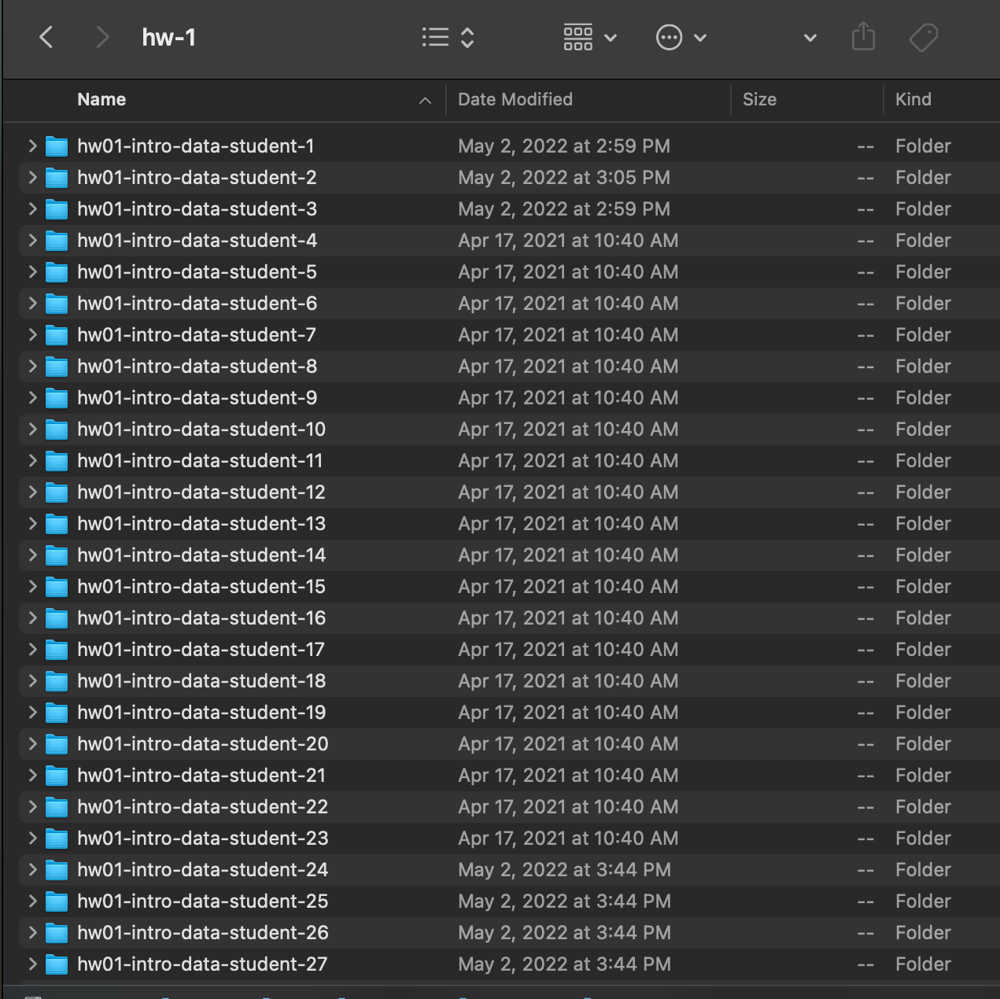
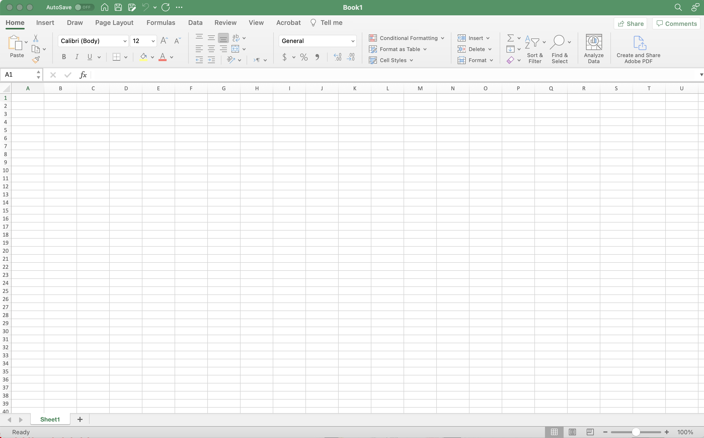
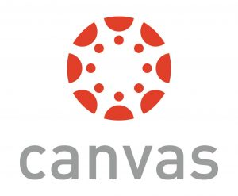

class: hide-count, middle, center


```{r xaringan-panelset, echo=FALSE}
xaringanExtra::use_panelset()
```

.panelset[
.panel[.panel-name[Federica Zoe Ricci]

```{r echo=FALSE, fig.align='center', out.width = "20%", fig.alt = ""}

```

University of California, Irvine
`r fontawesome::fa(name = "link")` <a href = "https://federicazoe.github.io/">federicazoe.github.io</a>
`r fontawesome::fa(name = "envelope")` <a href = "fzricci@uci.edu">fzricci@uci.edu</a>

]

.panel[.panel-name[Catalina Mari Medina]

```{r echo=FALSE, fig.align='center', out.width = "20%", fig.alt = ""}

```

University of California, Irvine
`r fontawesome::fa(name = "link")` <a href = "https://catalinamedina.github.io/">catalinamedina.github.io</a>
`r fontawesome::fa(name = "envelope")` <a href = "catalmm1@uci.edu">catalmm1@uci.edu</a> 

]

.panel[.panel-name[Mine Dogucu]

```{r echo=FALSE, fig.align='center', out.width = "20%", fig.alt = ""}
knitr::include_graphics("figures/mine-dogucu.jpeg")
```

University College London and University of California, Irvine
`r fontawesome::fa(name = "link")` <a href = "http://minedogucu.com">minedogucu.com</a>


]
]

---


## Workshop outline

- Introduction 

--

- Grading preparation

--

- Core functionalities

--

- **_30 min break (2:30-3pm)_**

--

- Additional functionalities

--

- gradetools + GitHub

--

- Recap, questions and your feedback

---

## Workshop outcomes

Participants will be able to:

--

- describe scope of gradetools

--

- identify grading situations where gradetools would be advantageous

--

- employ gradetools to grade assignments using core and extended functionalities

--

We will also provide an introduction to class management on Github!

---

class: middle, center

# Introduction

---

## How did gradetools come about?

.pull-left2[

Once upon a time, Federica was a TA for Mine...

]

.pull-right2[
<br>
<br>
```{r echo=FALSE, out.width="70%", fig.align='right', fig.alt="Person with long hair sitting with their laptop"}
knitr::include_graphics("figures/girl-grading.webp")
```
]

---

## How did gradetools come about?

.pull-left2[

- Downloading student files

]

.pull-right2[
<br>
<br>
```{r echo=FALSE, out.width="80%", fig.align='right', fig.alt="GitHub logo"}
knitr::include_graphics("figures/github-logo.png")
```
]

---


.pull-left2[
## How did gradetools come about?

- Downloading student files

- Open each student's file(s), one by one

]

.pull-right2[
```{r echo=FALSE, out.width="180%", fig.align='right', fig.alt="A folder structure titled hw-1. There are multiple hw01 folders for different students."}

```

]

---

## How did gradetools come about?

.pull-left2[
- Downloading student files

- Open each student's file(s), one by one

- Finding the corresponding student on the grade sheet


]

.pull-right2[

<br>
<br>
```{r echo=FALSE, out.width="100%", fig.align='right', fig.alt="A screenshot of Microsoft Excel"}

```

]

---

## How did gradetools come about?

.pull-left2[
- Downloading student files

- Open each student's file(s), one by one

- Finding the corresponding student on the grade sheet

- Evaluating student's work


]

.pull-right2[

<br>
<br>

```{r echo=FALSE, out.width="100%", fig.align='right', fig.alt="RStudio logo"}
knitr::include_graphics("figures/rstudio-logo.png")
```

]


---

## How did gradetools come about?

.pull-left2[

- Downloading student files

- Open each student's file(s), one by one

- Finding the corresponding student on the grade sheet

- Evaluating student's work

- Assigning a score for the work 


]

.pull-right2[

<br>
<br>
```{r echo=FALSE, out.width="100%", fig.align='right', fig.alt="A screenshot of Microsoft Excel"}

```

]

---

## How did gradetools come about?

.pull-left2[

- Downloading student files

- Open each student's file(s), one by one

- Finding the corresponding student on the grade sheet

- Evaluating student's work

- Assigning a score for the work 

- Preparing individualized feedback 

]

.pull-right2[

<br>
<br>
```{r echo=FALSE, out.width="100%", fig.align='center', fig.alt="RStudio logo"}
knitr::include_graphics("figures/rstudio-logo.png")
```


]

---

## How did gradetools come about?

.pull-left2[

- Downloading student files

- Open each student's file(s), one by one

- Finding the corresponding student on the grade sheet

- Evaluating student's work

- Assigning a score for the work 

- Preparing individualized feedback

- Distributing feedback and grades

]

.pull-right2[


```{r echo=FALSE, out.width="70%", fig.align='right', fig.alt="GitHub logo"}
knitr::include_graphics("figures/github-logo.png")
```

```{r echo=FALSE, out.width="70%", fig.align='right', fig.alt="Canvas logo"}

```


]

---

## How did gradetools come about?

.pull-left2[
- Downloading student files

- **Open each student's file(s), one by one**

- **Finding the corresponding student on the grade sheet**

- **Evaluating student's work**

- **Assigning a score for the work**

- **Preparing individualized feedback**

- Distributing feedback and grades

]

.pull-right2[

<br>
<br>
```{r echo=FALSE, out.width="100%", fig.align='center', fig.alt="RStudio Logo"}
knitr::include_graphics("figures/rstudio-logo.png")
```


]

---

class: middle

## grading stages

![:col_header 
<span style="font-size:23px; color:whitesmoke;">1. Preparation <br> <br> </span>
  <i class="fa-solid fa-file-arrow-down" aria-hidden="true" style="font-size:90px; color:whitesmoke;"></i>,
  <span style="font-size:23px;; color:whitesmoke;">2. Grading and Feedback <br> <br> </span>
  <i class="fa-solid fa-pen-to-square" aria-hidden="true" style="font-size:90px; color:whitesmoke;"></i>,
  <span style="font-size:23px; color:whitesmoke;">3. Returning grades & feedback <br> <br> </span>
  <i class="fa-solid fa-file-arrow-up" aria-hidden="true" style="font-size:90px; color:whitesmoke;"></i>
              ]

---

class: middle

## gradetools main role

![:col_header 
<span style="font-size:23px; color:whitesmoke;">1. Preparation <br> <br> </span>
  <i class="fa-solid fa-file-arrow-down" aria-hidden="true" style="font-size:90px; color:whitesmoke;"></i>,
  <span style="font-size:23px; color:#ffcc66;">2. Grading and Feedback <br> <br> </span>
  <i class="fa-solid fa-pen-to-square" aria-hidden="true" style="font-size:90px; color:#ffcc66;"></i>,
  <span style="font-size:23px; color:whitesmoke;">3. Returning grades & feedback <br> <br> </span>
  <i class="fa-solid fa-file-arrow-up" aria-hidden="true" style="font-size:90px; color:whitesmoke;"></i>
              ]


---

class: middle, center


### Demo of gradetools in action!


