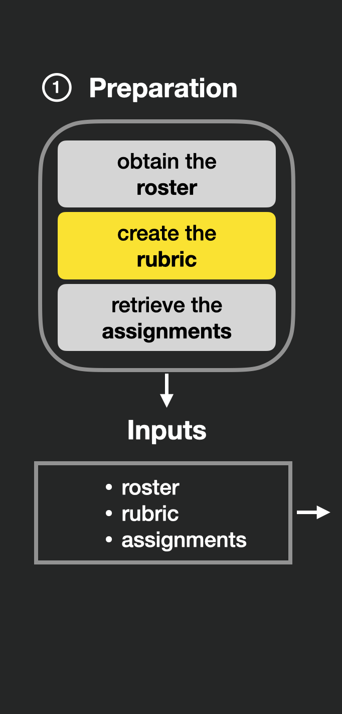
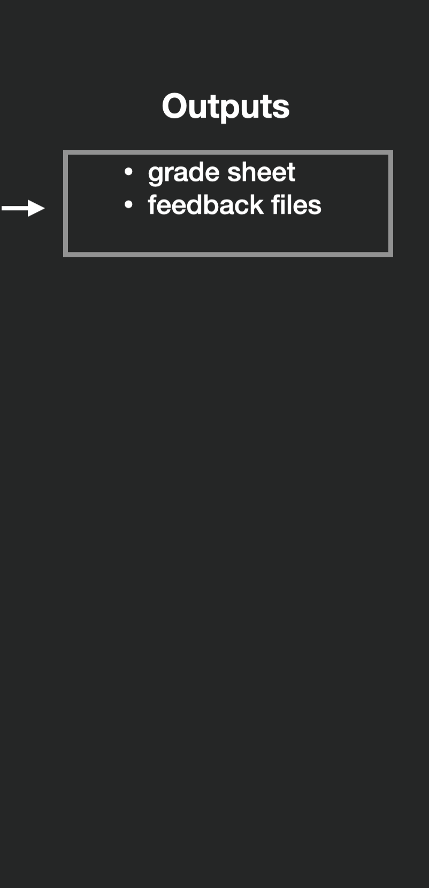
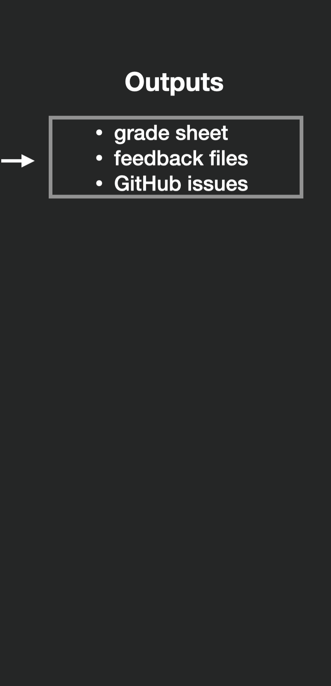
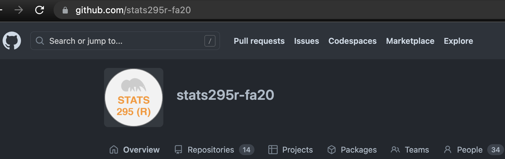
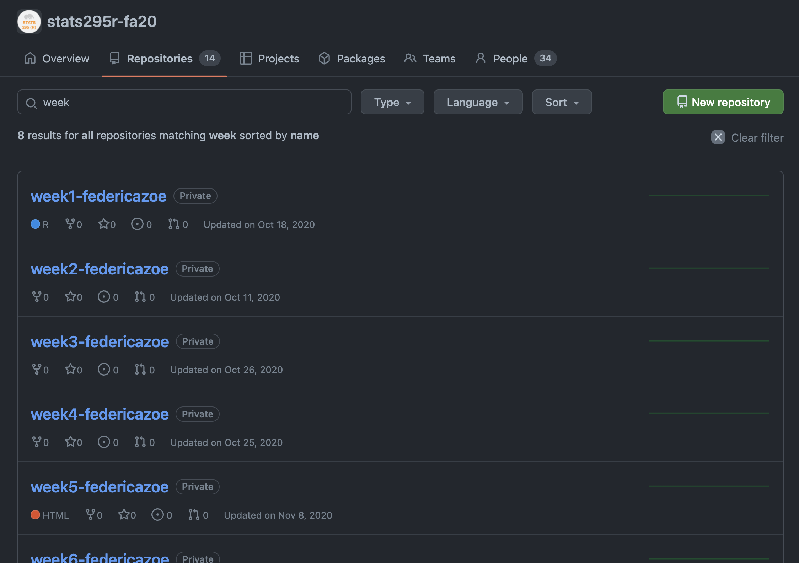
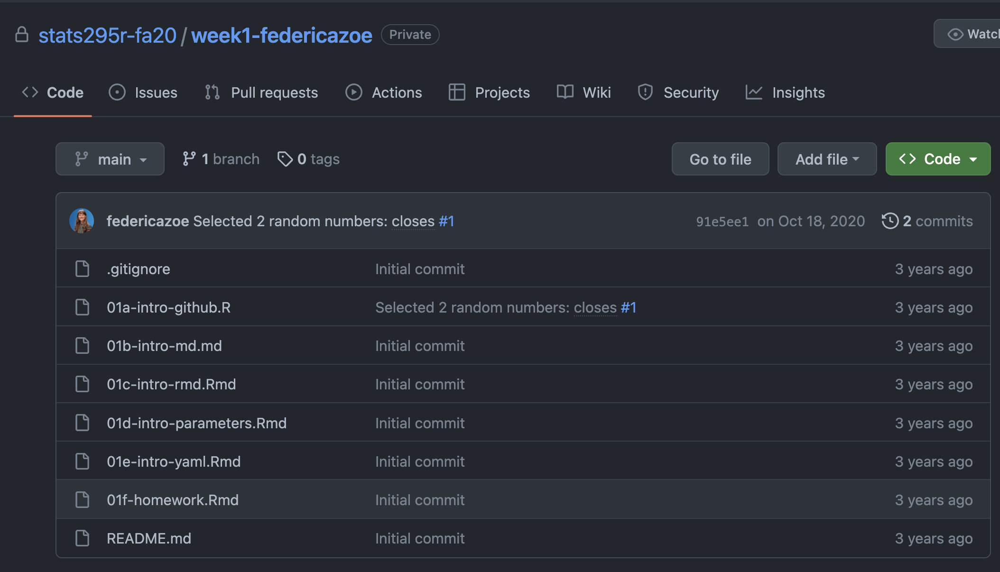
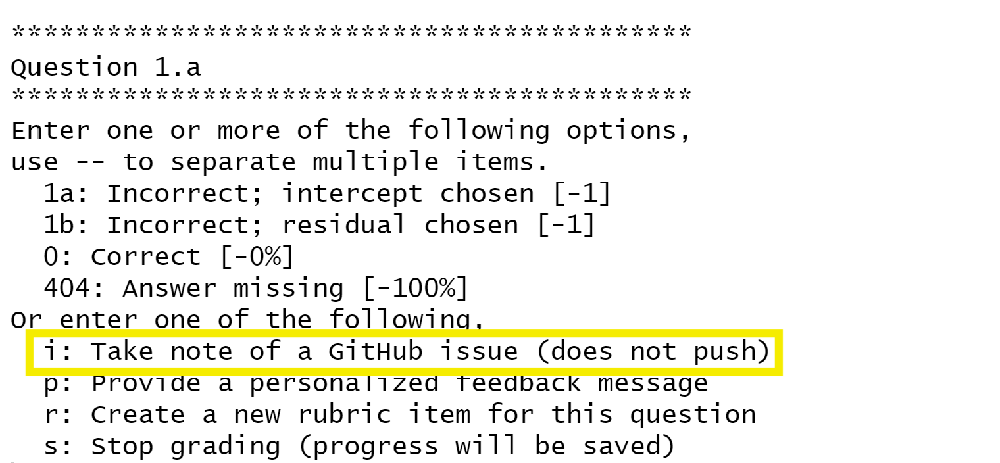
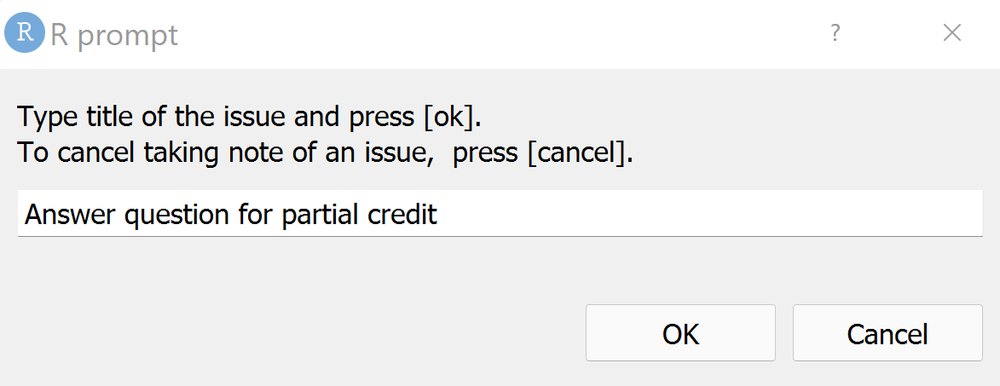
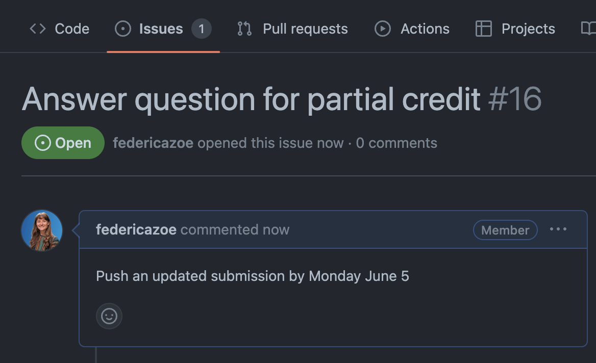
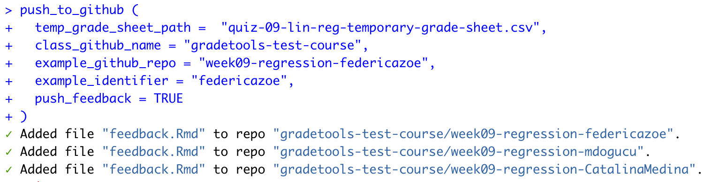

---
output:
  xaringan::moon_reader:
    css: ["utils/style.css","https://cdnjs.cloudflare.com/ajax/libs/font-awesome/6.1.1/css/all.min.css", "xaringan-themer.css"]
    lib_dir: libs
    nature:
      ratio: 16:9
      highlightStyle: solarized-light
      highlightLines: true
      countIncrementalSlides: true
      beforeInit: "utils/cols_macro.js"
---

class: middle, center

# gradetools **+** GitHub

---

class: middle, center

<div class="row">
  <div class="column_left">
    
  </div>
  <div class="column_center">
    
  </div>
  <div class="column_right">
    
  </div>
</div>

---

class: middle, center

<div class="row">
  <div class="column_left">
    
  </div>
  <div class="column_center">
    
  </div>
  <div class="column_right">
    
  </div>
</div>

---

class: middle, center

<div class="row">
  <div class="column_left">
    
  </div>
  <div class="column_center">
    
  </div>
  <div class="column_right">
    
  </div>
</div>


---

## GitHub for a course?

.pull-left-small[

Our favorite way:

- One **GitHub organization** per course


]

.pull-right-large[

```{r echo=FALSE, fig.align='center', out.width = "100%", fig.alt = "Screenshot of GitHub webpage showing an organization with 'stats295r-fa20'. There are 14 repositories and 34 people in the organization."}

```

]


---

## GitHub for a course?

.pull-left-small[

Our favorite way:

- One repo per student, per week or assignment

]

.pull-right-large[

```{r echo=FALSE, fig.align='center', out.width = "100%", fig.alt = "Screenshot of repos in the organization 'stats295r-fa20' named 'week1-federicazoe', 'week2-federicazoe', 'week3-fedeericazoe' and so on."}

```

]

---

## GitHub for a course?

.pull-left-small[

Our favorite way:

- Quizzes and homework distributed and submitted in the repo

]

.pull-right-large[

```{r echo=FALSE, fig.align='center', out.width = "100%", fig.alt = "screenshot of files included in the repo 'week1-federicazoe'. The list includes a mix of .R, .Rmd and .md files and a filed named '01f-homework.Rmd'."}

```

]

---

class: middle


## Why use GitHub for a course?

- reproducibility, version control, collaboration

--

- students can learn GitHub hands-on

--

- we can easily share individualized feedback with students

--

- package [ghclass](https://rundel.github.io/ghclass/) makes it easy to manage courses on GitHub using R


---

## How does gradetools interact with GitHub?

.pull-left-small[

- Take note of issues while grading

]

.pull-right-large[

```{r echo=FALSE, fig.align='center', out.width = "100%", fig.alt = "screenshot of RStudio console with a grading prompt with an highlighted portion that says the prompt code 'i' corresponds to 'Take note of a GitHub issue (not push)'."}

```

]

---

## How does gradetools interact with GitHub?

.pull-left-small[

- Take note of issues while grading

]

.pull-right-large[

```{r echo=FALSE, fig.align='center', out.width = "100%", fig.alt = "Screenshot of a R prompt to provide title of issue. Title provided is 'answer question for partial credit'."}

```

]

---

## How does gradetools interact with GitHub?

.pull-left-small[

- Take note of issues while grading

- Create issues in students (or team) repos

]

.pull-right-large[

```{r, eval=FALSE}
push_to_github()
```

]
---

## How does gradetools interact with GitHub?

.pull-left-small[

- Take note of issues while grading

- Create issues in students (or team) repos

]

.pull-right-large[

```{r echo=FALSE, fig.align='center', out.width = "100%", fig.alt = "screenshot of GitHub showing an issue titled 'Answer question for partial credit' and whose body says 'Push an updated submission by Monday June 5'."}

```

]

---

## How does gradetools interact with GitHub?

.pull-left-small[

- Take note of issues while grading

- Create issues in students (or team) repos

- Push feedback files

]

.pull-right-large[

```{r echo=FALSE, fig.align='center', out.width = "100%", fig.alt = "screenshot of RStudio console showing confirmation that three feedback files have been pushed to GitHub after running the function push_to_github()'."}

```

]

---

background-image: url(figures/github-logo.png)
background-position: top right

## Hands-on!

In GitHub:

--

- Create a new [GitHub organization](https://docs.github.com/en/organizations/collaborating-with-groups-in-organizations/creating-a-new-organization-from-scratch)

  - name it `uscots-gradetools-your GitHub username`

--

- Fork the repository [final-project-team-gamma](https://github.com/gradetools-test-course/final-project-team-YOUR_GITHUB_USERNAME) from the [gradetools-test-course](https://github.com/gradetools-test-course) organization into your new organization

--

- Change the name of the repo by filling-in your GitHub username


---

background-image: url(https://d33wubrfki0l68.cloudfront.net/7e89f71ee68cff45427e783fdc58510a9e32dfc9/0da76/wp-content/uploads/2018/10/rstudio-logo-white.png)
background-position: top right

## Hands-on!

In RStudio:

--

- Fork our `gradetools-USCOTS2023` repo if you haven't done yet

--

- Install and load [ghclass](https://rundel.github.io/ghclass/index.html)

```{r, eval=FALSE}
install.packages("ghclass")
library(ghclass)
```

---

background-image: url(https://d33wubrfki0l68.cloudfront.net/7e89f71ee68cff45427e783fdc58510a9e32dfc9/0da76/wp-content/uploads/2018/10/rstudio-logo-white.png)
background-position: top right

## Hands-on!

In RStudio<sup>1</sup>:

- Pull the repo `final-project-team-gamma` from your organization locally

```{r, eval=FALSE}
local_repo_clone(
  repo = org_repos(org = "YOUR ORGANIZATION", 
                            filter = "final-project-team"),
  local_path = "final-project-team-repos"
)
```

```{r, eval = FALSE}
> ✔ Cloned "YOUR ORGANIZATION/final-project-team-gamma".
```

.footnote[[1] Prerequisites: GitHub token setup]


---

class: middle

## Hands-on: preparing roster

.pull-left[

- Make minimal roster

- A column named `student_identifier` 

  - must be your GitHub username

]

.pull-right[
  
|  student_identifier  | 
|----------------------|
| YOUR GITHUB USERNAME | 
  
]

---

class: middle

## Hands-on: prepare roster

Example roster

```{r, eval=FALSE}
roster <- data.frame(
  student_identifier = c("YOUR GITHUB USERNAME")
)
write_csv(roster, "roster.csv")
```


---

class: middle

## Hands-on: rubric

- The repo has a single file named `presentation.Rmd`

--

- We included the rubric in the folder `demonstration-materials/github-demo`

---

class: middle

## Hands-on: grading

- We are going to use `assist_advanced_grading(..., github_issues = TRUE)` to grade

---

## Hands-on: grading

```{r, eval=FALSE}

assist_advanced_grading(
  rubric_path,
  roster_path,
  grading_progress_log_path,
  final_grade_sheet_path,
  example_assignment_path,
  example_feedback_path,
  example_student_identifier,
  github_issues = TRUE
)

```

---

## Hands-on: grading

```{r, eval=FALSE}

assist_advanced_grading(
  {{rubric_path,}}
  {{roster_path,}}
  grading_progress_log_path,
  final_grade_sheet_path,
  example_assignment_path,
  example_feedback_path,
  example_student_identifier,
  github_issues = TRUE
)

```

_Reminder:_ These are the paths where rubric and roster are stored.


---

## Hands-on: grading

```{r, eval=FALSE}

assist_advanced_grading(
  rubric_path,
  roster_path,
  {{grading_progress_log_path,}}
  {{final_grade_sheet_path,}}
  example_assignment_path,
  example_feedback_path,
  example_student_identifier,
  github_issues = TRUE
)

```

_Reminder:_  These are the paths where we want to store grading-progress files.

---

## Hands-on: grading

```{r, eval=FALSE}

assist_advanced_grading(
  rubric_path,
  roster_path,
  grading_progress_log_path,
  final_grade_sheet_path,
  {{example_assignment_path,}}
  {{example_feedback_path,}}
  {{example_student_identifier,}}
  github_issues = TRUE
)

```

_Reminder:_  These are, respectively, the path to `presentation.Rmd`, the path where we want to store the feedback file and your GitHub username.

---

## Hands-on: grading

```{r, eval=FALSE}

assist_advanced_grading(
  rubric_path,
  roster_path,
  grading_progress_log_path,
  final_grade_sheet_path,
  example_assignment_path,
  example_feedback_path,
  example_student_identifier,
  {{github_issues = TRUE}}
)

```

**New:**  These must be set to `TRUE` to enable annotating GitHub issues while grading.

---

## Hands-on: grading

- After the presentation has been open, we can _knit it_ and browse it in the _Viewer pane_

--

- First, take a note of an issue for improving the title

  - Enter **prompt 'i'**

--

- Next, assign a rubric item

--

- Finally, give some encouraging general feedback

---

## Hands-on: creating issues and pushing feedback

- Use function `push_to_github()`:


```{r, eval=FALSE}
push_to_github (
  grading_progress_log_path,
  class_github_name,
  example_github_repo,
  example_identifier,
  push_feedback,
  create_issues
)
```


---

## Hands-on: creating issues and pushing feedback

```{r, eval=FALSE}
push_to_github (
  {{grading_progress_log_path,}}
  class_github_name,
  example_github_repo,
  example_identifier,
  push_feedback,
  create_issues
)
```

This is the path provided when using `assist_advanced_grading()`, where the file `grading_progress_log.csv` was stored.

---

## Hands-on: creating issues and pushing feedback

```{r, eval=FALSE}
push_to_github (
  grading_progress_log_path,
  {{class_github_name,}}
  example_github_repo,
  example_identifier,
  push_feedback,
  create_issues
)
```

This is the name of your **GitHub organization**.

---

## Hands-on: creating issues and pushing feedback


```{r, eval=FALSE}
push_to_github (
  grading_progress_log_path,
  class_github_name,
  {{example_github_repo,}}
  example_identifier,
  push_feedback,
  create_issues
)
```

This is the name of the repo where the assignment is.

---

## Hands-on: creating issues and pushing feedback

```{r, eval=FALSE}
push_to_github (
  grading_progress_log_path,
  class_github_name,
  example_github_repo,
  {{example_identifier,}}
  push_feedback,
  create_issues
)
```

This is your GitHub username.

---

## Hands-on: creating issues and pushing feedback

```{r, eval=FALSE}
push_to_github (
  grading_progress_log_path,
  class_github_name,
  example_github_repo,
  example_identifier,
  {{push_feedback = TRUE,}}
  {{create_issues = TRUE}}
)
```

These must be set to TRUE if we want to both push feedback and create issues.

---


class: middle, center

<div class="row">
  <div class="column_left">
    
  </div>
  <div class="column_center">
    
  </div>
  <div class="column_right">
    
  </div>
</div>

---


class: middle

## Thank you for your time!

- Please let us know any suggestions for gradetools: [feedback form](https://forms.gle/MwyxmT6zEf9tokCM9) 

```{r echo=FALSE, out.width="10%", fig.align='center', fig.alt="QR code linking to feedback form above"}

```

- Keep an eye out for the gradetools manuscript (in progress), which describes our package from a development viewpoint
- For more information and practice visit the gradetools website (https://federicazoe.github.io/gradetools/)
