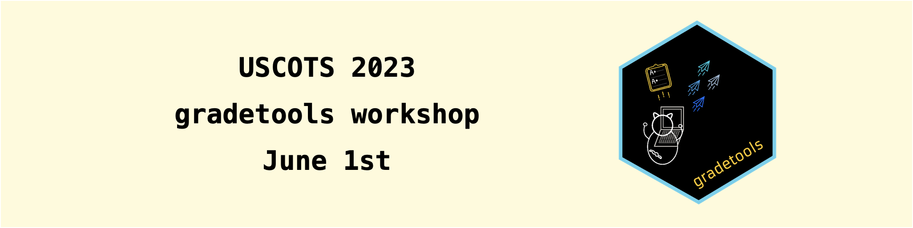

**Note: The repo is currently under construction. Material will be finalized one week prior to the workshop.**

This repo hosts material for the workshop [_Automate your grading workflow with gradetools: a grading assistant in RStudio_](https://www.causeweb.org/cause/uscots/uscots23/w12-automate-your-grading-workflow-gradetools-grading-assistant-rstudio-room-105) that will be held on June 1st, 2023 from 1:00 to 4:30pm ET during the [USCOTS 2023](https://www.causeweb.org/cause/uscots/uscots23) conference.

Please fill out this brief [pre-workshop survey](https://docs.google.com/forms/d/e/1FAIpQLSfeZjPRRNA3SqXNiOBHCsOSqJE7SweW7dbG4-YbmkGdu9uvCw/viewform?usp=sf_link) by Monday, May 29th.

This is a hands-on workshop, and we want to make sure everyone comes prepared to get the most out of it. There are some [requirements and recommendations](https://docs.google.com/document/d/1Bh17nAwhkXhkyOfdiDouxyFaAxeeR7QzM1kbuiraSMM/edit#heading=h.z8r4uf686pdz) that we ask you to complete before attending the workshop on June 1st.

## Workshop timeline

- **First part** (1-2:30pm)
  -  Introduction 
  -  Grading preparation
  -  Core grading functionalities

- **Break** (2:30-3pm)

- **Second part** (3-4:30pm)
  - Extended grading functionalities
  - gradetools + GitHub
  - Q&A and Feedback

## Feedback

After the workshop, you can submit feedback on gradetools [here](https://docs.google.com/forms/d/e/1FAIpQLSdbX-PSiq-1F1BNG7qAASF9ycIOUZQw_Lv1llxa23YHLQ-vWQ/viewform?usp=sf_link).
