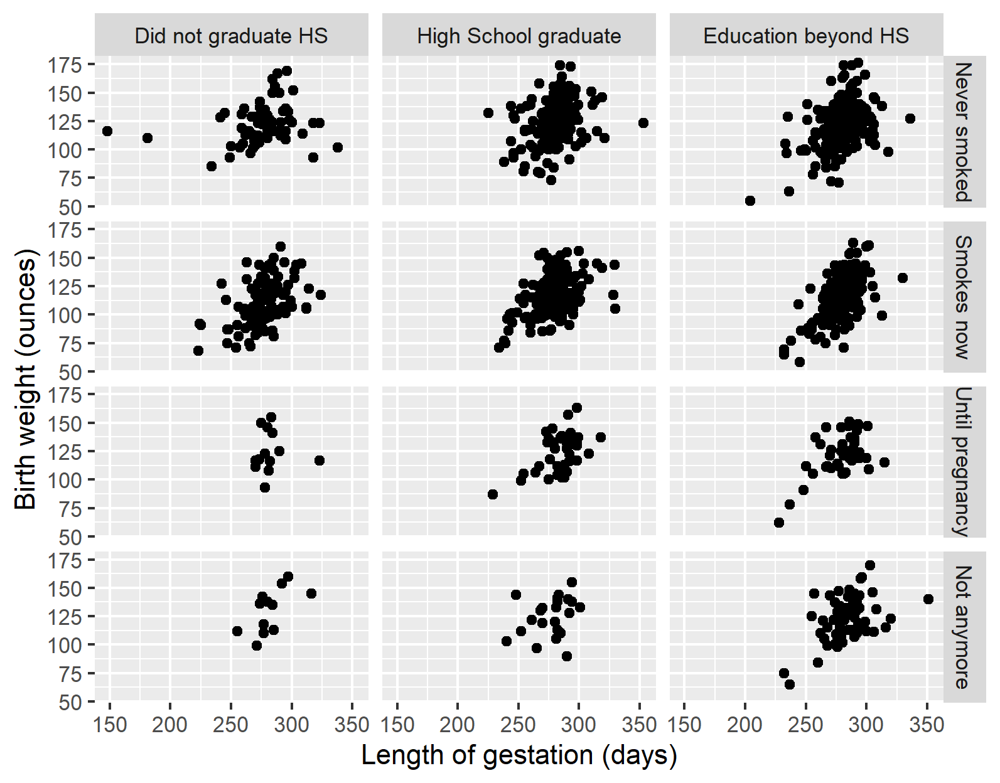

```{r message=FALSE}
knitr::opts_chunk$set(echo = FALSE)

library(tidyverse)
library(UsingR)

data(babies)
```

In this document we will be using the `babies` data frame, which is available through the `UsingR` library. After running the code above, if you write `?babies` in your Console, you would find the descriptions for each variable. Note that by making visualizations we are exploring what we see, we will not jump to conclusions yet!

Throughout the exercises, make sure you use a reasonable font size and label axes. You are welcome to use colors and themes whenever you would like. Adhere to tidyverse style guide.

Run the code below to drop observations with unknown values for variables of interest and to recategorize two variables. In this analysis we will use the `babies_filtered` data frame instead of `babies`.
```{r}
babies_filtered <- babies %>% 
  filter(wt != 999) %>% 
  filter(age != 99) %>% 
  filter(gestation != 999) %>% 
  filter(smoke != 9) %>% 
  filter(ed != 9) %>% 
  mutate(smoke = factor(
    smoke,
    levels = c(0, 1, 2, 3),
    labels = c("Never smoked", "Smokes now", "Until pregnancy", "Not anymore")
  )) %>% 
  mutate(ed = factor(
    case_when(
      ed %in% 0:1 ~ "Did not graduate HS",
      ed == 2 ~ "High School graduate",
      ed %in% 3:7 ~ "Education beyond HS"
    ),
    levels = c("Did not graduate HS", "High School graduate", "Education beyond HS")
  ))
```


## Question 1

How many observations and variables are there? What does each observation represent? Answer with inline code when appropriate.

**Answer**


## Question 2 

Say we wanted to explore length of gestation by mother's smoking habit. Would a scatter plot be an appropriate plot? If not, suggest a plot that would be. Explain your answer either way.

**Answer**


## Question 3

Suppose you had intuition that a baby's birth weight was related to the age of it's mother at the time of the baby's birth. Which would be the response variable and which would be the explanatory variable? 

Make a plot to examine the relationship between mother's age and baby's birth weight, with the explanatory and response variables on the appropriate axes.

**Answer**


## Question 4

Use `babies_filtered` to remake this plot.

```{r echo = FALSE}

```

**Answer**
