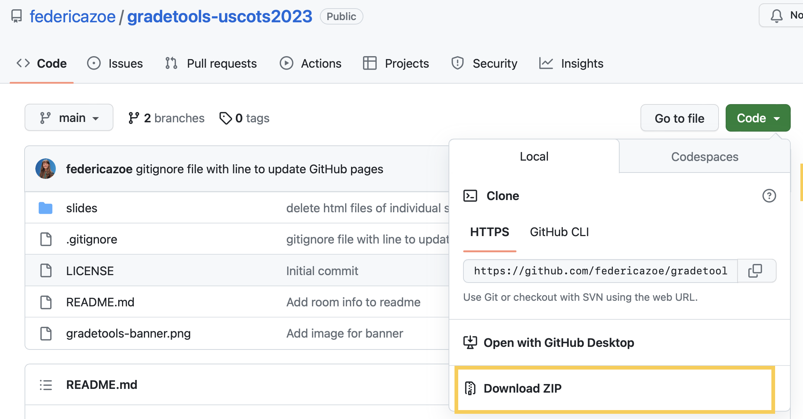
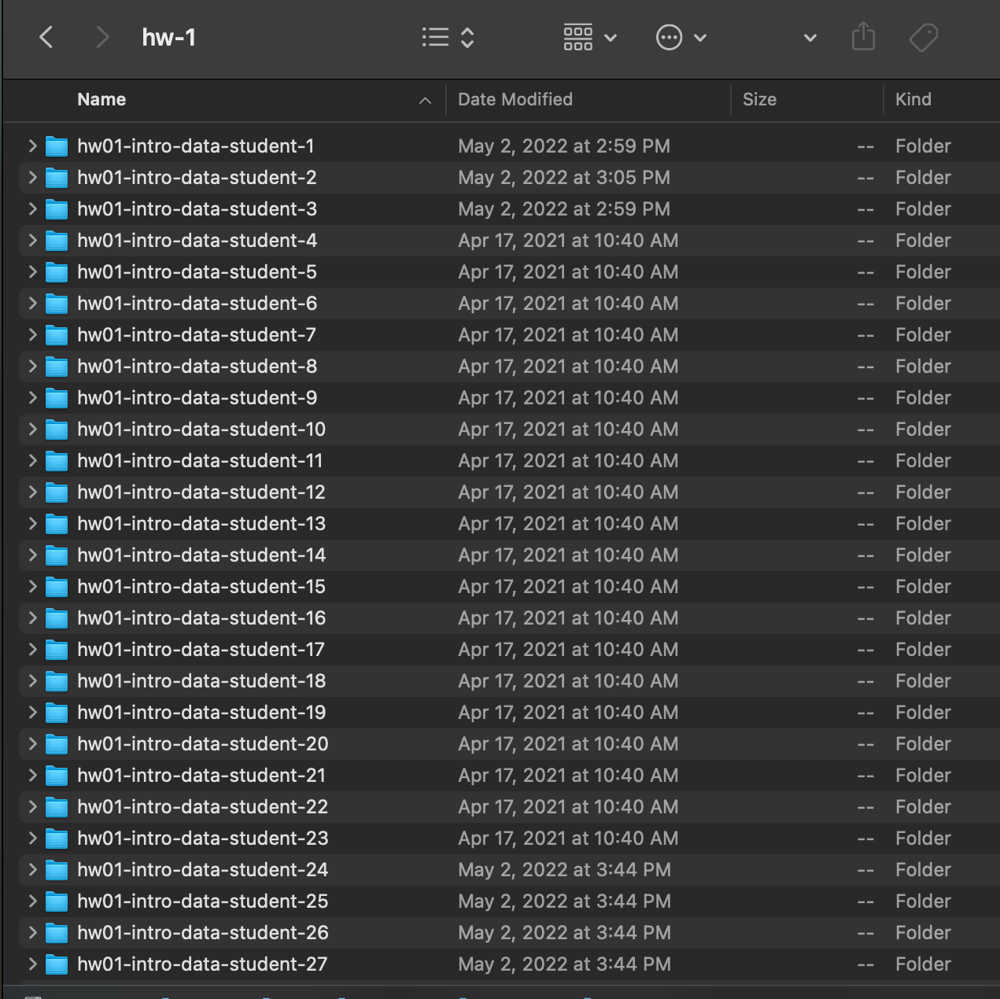
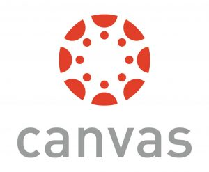

class: hide-count, middle, center


```{r xaringan-panelset, echo=FALSE}
xaringanExtra::use_panelset()
```

.panelset[
.panel[.panel-name[Federica Zoe Ricci]

```{r echo=FALSE, fig.align='center', out.width = "20%", fig.alt = ""}

```

PhD Student @ University of California, Irvine

**Stats interests:** Bayesian statistics + Statistics Education

**Other interests:** Hiking, traveling and cooking

**Website:** `r fontawesome::fa(name = "link")` <a href = "https://federicazoe.github.io" style="color:whitesmoke;"> federicazoe.github.io</a>

]

.panel[.panel-name[Catalina Mari Medina]

```{r echo=FALSE, fig.align='center', out.width = "20%", fig.alt = ""}
knitr::include_graphics("figures/catalina-medina.jpg")
```

PhD Student @ University of California, Irvine

**Stats interests:** Statistics for Public Health + Statistics Education

**Other interests:** Reading, cooking and binging TV

**Website:**  `r fontawesome::fa(name = "link")` <a href = "https://catalinamedina.github.io/" style="color:whitesmoke;">catalinamedina.github.io</a>

]

.panel[.panel-name[Mine Dogucu]

```{r echo=FALSE, fig.align='center', out.width = "20%", fig.alt = ""}
knitr::include_graphics("figures/mine-dogucu.jpeg")
```

Lecturer @ University College London 

Assistant professor @ University of California, Irvine

**Website:**  `r fontawesome::fa(name = "link")` <a href = "http://minedogucu.com" style="color:whitesmoke;"> minedogucu.com</a>


]
]

---

## Take a moment to

- download latest version of this workshop material from
  [https://github.com/federicazoe/gradetools-uscots2023](https://github.com/federicazoe/gradetools-uscots2023)
  
```{r echo=FALSE, out.width="80%", fig.align='center', fig.alt="Person with long hair sitting with their laptop"}

```

- link to slides for each sections can be found there

---

## Survey

.panelset[
.panel[.panel-name[From what we've asked you]

Today's participants:

- represent a wide array of institutions
- teach classes of varied sizes

The **variety of your experiences** will be very helpful for us to learn improvements that can make gradetools even more helpful!

]
]

---

## Survey

.panelset[
.panel[.panel-name[From what we've asked you]

At least half of you teach a course that involves some computing

- This is great because gradetools was made to be compatible with **computing assignments**

- We are working on a new and improved version of gradetools, which **will include** compatibility with **pdfs**!

]
.panel[.panel-name[What we should've asked you]

- Do you feel at least moderately comfortable with RStudio?
- Have you brought your own student submissions to grade?
- Have you ever used GitHub?
- Have you ever used GitHub for your class?

]
]

---

## Workshop outline

- Introduction 

--

- Grading inputs & outputs

--

- Core functionalities

--

- **_30 min break (2:30-2:45pm)_**

--

- Additional functionalities

--

- gradetools + GitHub

--

Note: workshop ends at 4:15 pm

---

class: middle, center

# Introduction

---
class:  middle

## Terminology

--

**Grade** - numeric score (e.g. 3.5)

--

**Feedback** - qualitative comment (e.g. "The response variable should be on the y axis")

---

class: middle

## Let's think about grading

![:col_header 
<span style="font-size:23px; color:whitesmoke;">1. Preparation <br> <br> </span>
  <i class="fa-solid fa-file-arrow-down" aria-hidden="true" style="font-size:90px; color:whitesmoke;"></i>,
  <span style="font-size:23px;; color:whitesmoke;">2. Grading and Feedback <br> <br> </span>
  <i class="fa-solid fa-pen-to-square" aria-hidden="true" style="font-size:90px; color:whitesmoke;"></i>,
  <span style="font-size:23px; color:whitesmoke;">3. Returning grades & feedback <br> <br> </span>
  <i class="fa-solid fa-file-arrow-up" aria-hidden="true" style="font-size:90px; color:whitesmoke;"></i>
              ]

---

class: middle

## gradetools focus

![:col_header 
<span style="font-size:23px; color:whitesmoke;">1. Preparation <br> <br> </span>
  <i class="fa-solid fa-file-arrow-down" aria-hidden="true" style="font-size:90px; color:whitesmoke;"></i>,
  <span style="font-size:23px; color:#ffcc66;">2. Grading and Feedback <br> <br> </span>
  <i class="fa-solid fa-pen-to-square" aria-hidden="true" style="font-size:90px; color:#ffcc66;"></i>,
  <span style="font-size:23px; color:whitesmoke;">3. Returning grades & feedback <br> <br> </span>
  <i class="fa-solid fa-file-arrow-up" aria-hidden="true" style="font-size:90px; color:whitesmoke;"></i>
              ]


---

class: middle

## How did gradetools come about?

.pull-left2[

Once upon a time, Federica was a TA for Mine...


]

.pull-right2[
<br>
<br>
```{r echo=FALSE, out.width="70%", fig.align='right', fig.alt="Person with long hair sitting with their laptop"}

```
]

---

class: middle

## How did gradetools come about?

.pull-left2[

Once upon a time, Federica was a TA for Mine...

... and she needed to grade many .R and .Rmd files for every homework

]

.pull-right2[
<br>
<br>
```{r echo=FALSE, out.width="70%", fig.align='right', fig.alt="Person with long hair sitting with their laptop"}

```
]


---


## Grading tasks

.pull-left2[

- Downloading student files

]

.pull-right2[
<br>
<br>
```{r echo=FALSE, out.width="80%", fig.align='right', fig.alt="GitHub logo"}
knitr::include_graphics("figures/github-logo.png")
```
]

---


.pull-left2[
## Grading tasks

- Downloading student files

- Open each student's file(s), one by one

]

.pull-right2[
```{r echo=FALSE, out.width="180%", fig.align='right', fig.alt="A folder structure titled hw-1. There are multiple hw01 folders for different students."}

```

]

---

## Grading tasks

.pull-left2[
- Downloading student files

- Open each student's file(s), one by one

- Referencing the rubric


]

.pull-right2[

<br>
<br>
```{r echo=FALSE, out.width="100%", fig.align='right', fig.alt="A screenshot of Microsoft Excel"}
knitr::include_graphics("figures/excel.png")
```

]

---

## Grading tasks

.pull-left2[
- Downloading student files

- Open each student's file(s), one by one

- Referencing the rubric

- Evaluating student's work


]

.pull-right2[

<br>
<br>

```{r echo=FALSE, out.width="100%", fig.align='right', fig.alt="RStudio logo"}
knitr::include_graphics("figures/rstudio-logo.png")
```

]


---

## Grading tasks

.pull-left2[

- Downloading student files

- Open each student's file(s), one by one

- Referencing the rubric

- Evaluating student's work

- Assigning a score for the work 


]

.pull-right2[

<br>
<br>
```{r echo=FALSE, out.width="100%", fig.align='right', fig.alt="A screenshot of Microsoft Excel"}
knitr::include_graphics("figures/excel.png")
```

]

---

## Grading tasks

.pull-left2[

- Downloading student files

- Open each student's file(s), one by one

- Referencing the rubric

- Evaluating student's work

- Assigning a score for the work 

- Preparing individualized feedback 

]

.pull-right2[

<br>
<br>
```{r echo=FALSE, out.width="100%", fig.align='center', fig.alt="RStudio logo"}
knitr::include_graphics("figures/rstudio-logo.png")
```


]

---

## Grading tasks

.pull-left2[

- Downloading student files

- Open each student's file(s), one by one

- Referencing the rubric

- Evaluating student's work

- Assigning a score for the work 

- Preparing individualized feedback

- Distributing feedback and grades

]

.pull-right2[


```{r echo=FALSE, out.width="70%", fig.align='right', fig.alt="GitHub logo"}
knitr::include_graphics("figures/github-logo.png")
```

```{r echo=FALSE, out.width="70%", fig.align='right', fig.alt="Canvas logo"}

```


]

---

## Grading tasks

.pull-left2[
- Downloading student files

- **Open each student's file(s), one by one**

- **Referencing the rubric**

- **Evaluating student's work**

- **Assigning a score for the work**

- **Preparing individualized feedback**

- Distributing feedback and grades

]

.pull-right2[

<br>
<br>
```{r echo=FALSE, out.width="100%", fig.align='center', fig.alt="RStudio Logo"}
knitr::include_graphics("figures/rstudio-logo.png")
```


]


---

class: middle

.pull-left[

## Administrative Tasks

- Opening and closing files


]


---

class: middle

.pull-left[

## Administrative Tasks

- Opening and closing files

- Referencing the rubric


]

---

class: middle

.pull-left[

## Administrative Tasks

- Opening and closing files

- Referencing the rubric

- Entering and storing grades to the gradesheet

]

---

class: middle

.pull-left[

## Administrative Tasks

- Opening and closing files

- Referencing the rubric

- Entering and storing grades to the gradesheet

]

.pull-right[

## Pedagogical Decisions

- Evaluating students' work


]

---

class: middle

.pull-left[

## Administrative Tasks

- Opening and closing files

- Referencing the rubric

- Entering and storing grades to the gradesheet

]

.pull-right[

## Pedagogical Decisions

- Evaluating students' work

- Assigning a score

]

---

class: middle

.pull-left[

## Administrative Tasks

- Opening and closing files

- Referencing the rubric

- Entering and storing grades to the gradesheet

]

.pull-right[

## Pedagogical Decisions

- Evaluating students' work

- Assigning a score

- Providing feedback

]

---

class: middle 

The gradetools package 

- .emph[automates] the repetitive .emph[administrative tasks] in the grading workflow 

--

- minimizes switching between different interfaces

--

- .emph[saves time for] more meaningful tasks that require .emph[pedagogical decisions].

---

## Example: a homework

--

_Many of the following questions will be based on the **bike rental data** in Los Angeles. The data represents all bike rides from Metro Bike Share company in April-June of 2019._

_The data and a description of each variable can be found at (https://bikeshare.metro.net/about/data/)._

_Throughout the homework, make sure you use a reasonable font size and **label axes**. You are welcome to use colors and themes whenever you would like. Adhere to tidyverse style guide._

---

## Example: a homework

_**Question 1**_

_How many observations and variables are there? What does each observation represent? Answer with inline code when appropriate._

--

_**Question 2**_

_Make a plot that shows the number of rentals by each pass type._

--

_**Question 3**_

_Does bike type preference seem to vary by passholder type? Make a plot and refer to it in your answer to this question._


---

class: middle


### Demo of gradetools in action!

```{r, eval=FALSE}
assist_grading(
  rubric_path = "rubric.csv", 
  roster_path = "roster.csv", 
  grading_progress_log_path = "grading-progress-log.csv", 
  final_grade_sheet_path = "quiz01-final-grade-sheet.csv", 
  example_assignment_path = "quiz01/quiz01-BaronPoisson.Rmd",
  example_feedback_path = "quiz01/quiz01-BaronPoisson-feedback.html",
  example_student_identifier = "BaronPoisson"
)
```


