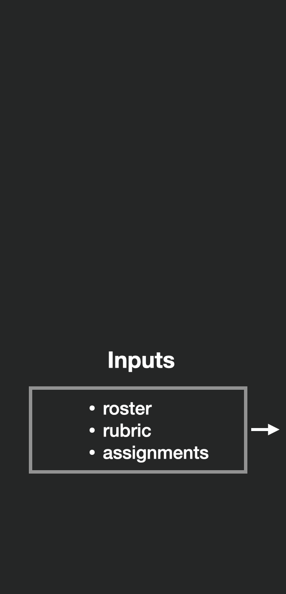
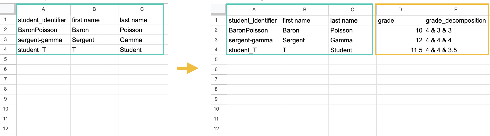
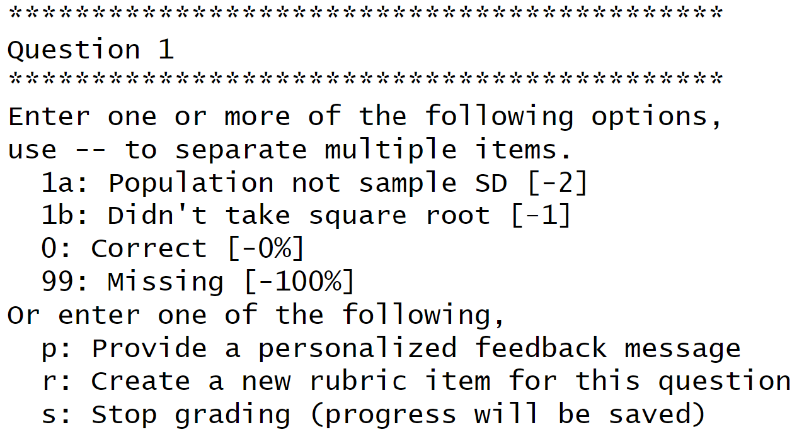
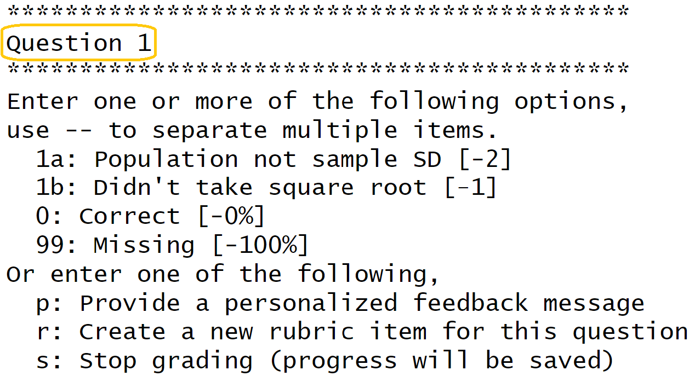

---
output:
  xaringan::moon_reader:
    css: ["utils/style.css","https://cdnjs.cloudflare.com/ajax/libs/font-awesome/6.1.1/css/all.min.css", "xaringan-themer.css"]
    lib_dir: libs
    nature:
      ratio: 16:9
      highlightStyle: solarized-light
      highlightLines: true
      countIncrementalSlides: true
      beforeInit: "utils/cols_macro.js"
---

class: middle, center

# Grading inputs & outputs


---

class: middle, left

## Function call

For the demo before, we ran

```{r, eval = FALSE}
assist_grading(
  rubric_path = "rubric.csv", 
  roster_path = "roster.csv", 
  grading_progress_log_path = "grading-progress-log.csv", 
  final_grade_sheet_path = "quiz01-final-grade-sheet.csv", 
  example_assignment_path = "quiz01/quiz01-BaronPoisson.Rmd",
  example_feedback_path = "quiz01/quiz01-BaronPoisson-feedback.html",
  example_student_identifier = "BaronPoisson"
)
```

---

class: middle, left

## Function call

```{r, eval = FALSE}
assist_grading(
  {{rubric_path = "rubric.csv", }}
  roster_path = "roster.csv", 
  grading_progress_log_path = "grading-progress-log.csv", 
  final_grade_sheet_path = "quiz01-final-grade-sheet.csv", 
  example_assignment_path = "quiz01/quiz01-BaronPoisson.Rmd",
  example_feedback_path = "quiz01/quiz01-BaronPoisson-feedback.html",
  example_student_identifier = "BaronPoisson"
)
```

Location of the rubric

---

class: middle, left

## Function call

```{r, eval = FALSE}
assist_grading(
  rubric_path = "rubric.csv", 
  {{roster_path = "roster.csv", }}
  grading_progress_log_path = "grading-progress-log.csv", 
  final_grade_sheet_path = "quiz01-final-grade-sheet.csv", 
  example_assignment_path = "quiz01/quiz01-BaronPoisson.Rmd",
  example_feedback_path = "quiz01/quiz01-BaronPoisson-feedback.html",
  example_student_identifier = "BaronPoisson"
)
```

Location of the roster

---

class: middle, left

## Function call

```{r, eval = FALSE}
assist_grading(
  rubric_path = "rubric.csv", 
  roster_path = "roster.csv", 
  {{grading_progress_log_path = "grading-progress-log.csv", }}
  {{final_grade_sheet_path = "quiz01-final-grade-sheet.csv", }}
  example_assignment_path = "quiz01/quiz01-BaronPoisson.Rmd",
  example_feedback_path = "quiz01/quiz01-BaronPoisson-feedback.html",
  example_student_identifier = "BaronPoisson"
)
```

Where we want the grading progress and the final grade book to be stored

---


class: middle, left

## Function call

```{r, eval = FALSE}
assist_grading(
  rubric_path = "rubric.csv", 
  roster_path = "roster.csv", 
  grading_progress_log_path = "grading-progress-log.csv", 
  final_grade_sheet_path = "quiz01-final-grade-sheet.csv", 
  {{example_assignment_path = "quiz01/quiz01-BaronPoisson.Rmd", }}
  example_feedback_path = "quiz01/quiz01-BaronPoisson-feedback.html",
  example_student_identifier = "BaronPoisson"
)
```

Location of one student's assignment submission

---

class: middle, left

## Function call

```{r, eval = FALSE}
assist_grading(
  rubric_path = "rubric.csv", 
  roster_path = "roster.csv", 
  grading_progress_log_path = "grading-progress-log.csv",
  final_grade_sheet_path = "quiz01-final-grade-sheet.csv", 
  example_assignment_path = "quiz01/quiz01-BaronPoisson.Rmd", 
  {{example_feedback_path = "quiz01/quiz01-BaronPoisson-feedback.html", }}
  example_student_identifier = "BaronPoisson"
)
```

Where we want their feedback file to be stored


---

class: middle, left

## Function call

```{r, eval = FALSE}
assist_grading(
  rubric_path = "rubric.csv", 
  roster_path = "roster.csv", 
  grading_progress_log_path = "grading-progress-log.csv", 
  final_grade_sheet_path = "quiz01-final-grade-sheet.csv", 
  {{example_assignment_path = "quiz01/quiz01-BaronPoisson.Rmd", }}
  {{example_feedback_path = "quiz01/quiz01-BaronPoisson-feedback.html", }}
  example_student_identifier = "BaronPoisson"
)
```

Note: we only have to provide the locations of the assignment and feedback files for **one student!**

---

class: middle, left

## Function call

```{r, eval = FALSE}
assist_grading(
  rubric_path = "rubric.csv", 
  roster_path = "roster.csv", 
  grading_progress_log_path = "grading-progress-log.csv",
  final_grade_sheet_path = "quiz01-final-grade-sheet.csv", 
  example_assignment_path = "quiz01/quiz01-BaronPoisson.Rmd", 
  example_feedback_path = "quiz01/quiz01-BaronPoisson-feedback.html",
  {{example_student_identifier = "BaronPoisson"}}
)
```

And that student's identifier (present in the roster)

---

class: middle, left

## Function call

```{r, eval = FALSE}
assist_grading(
  {{rubric_path = "rubric.csv",  }}
  {{roster_path = "roster.csv",  }}
  grading_progress_log_path = "grading-progress-log.csv",
  final_grade_sheet_path = "quiz01-final-grade-sheet.csv", 
  {{example_assignment_path = "quiz01/quiz01-BaronPoisson.Rmd",}}
  example_feedback_path = "quiz01/quiz01-BaronPoisson-feedback.html"  
  {{example_student_identifier = "BaronPoisson"  }}
)
```

So these are the **inputs** of grading 

---

class: middle, left

## Function call

```{r, eval = FALSE}
assist_grading(
  rubric_path = "rubric.csv",  
  roster_path = "roster.csv",  
  {{grading_progress_log_path = "grading-progress-log.csv", }}
  {{final_grade_sheet_path = "quiz01-final-grade-sheet.csv", }}
  example_assignment_path = "quiz01/quiz01-BaronPoisson.Rmd",
  {{example_feedback_path = "quiz01/quiz01-BaronPoisson-feedback.html", }}
  example_student_identifier = "BaronPoisson"
)
```

And these are the **outputs**

---

class: middle, center

<div class="row">
  <div class="column_left">
      </div>
  <div class="column_center">
    
  </div>
  <div class="column_right">
    
  </div>
</div>

---

class: middle, center

<div class="row">
  <div class="column_left">
      </div>
  <div class="column_center">
    
  </div>
  <div class="column_right">
    
  </div>
</div>

---

class: middle

## Roster: formatting

- .csv file

--

- Must have `student_identifier`  column
  - Can be anything unique to the student, for example:  
      - Name
      - Student id
      - GitHub username
  
---

class: center

## Roster: formatting

```{r echo=FALSE, out.width="60%", fig.align='center', fig.alt="A spreadsheet with a single column. The first row reads student_identifier. The other three rows read BaronPoisson, sergent-gamma and student_T"}

```

---

class: middle

## Roster: formatting

- .csv file

- Must have `student_identifier`  column
  - Can be anything unique to the student, for example:  
      - Name
      - Student id
      - GitHub username

--

- other columns can be present

---

class: center

## Roster
  
```{r echo=FALSE, out.width="60%", fig.align='center', fig.alt="A spreadsheet with four columns. The first row reads student_identifier, first name, last name, student ID. The other rows contain the corresponding information for three fictitious students."}
knitr::include_graphics("figures/roster-extra-columns.png")
```

---

class: center, middle

## Roster <i class="fa-solid fa-arrow-right"></i> Grade book
  
```{r echo=FALSE, out.width="100%", fig.align='center', fig.alt="On the left, a screenshot of a spreadsheet with four columns. The first row reads student_identifier, first name, last name, student ID. The other rows contain the corresponding information for three fictitious students. In the middle, a yellow arrow pointing from the figure on the left to the figure on the right. On the right, a screenshot of the same spreadsheet as the one shown on the left, but with an extra column indicating a numeric grade for each student."}

```

---

class: middle

## Roster

- used to **create the grade book**

--

- used to **find student submission files**
  - student identifiers from the roster must be the only thing unique in the file paths!
  
---

class: middle, center

<div class="row">
  <div class="column_left">
      </div>
  <div class="column_center">
    
  </div>
  <div class="column_right">
    
  </div>
</div>

---

class: middle, center

<div class="row">
  <div class="column_left">
      </div>
  <div class="column_center">
    
  </div>
  <div class="column_right">
    
  </div>
</div>

---


.pull-left2[

## Assignment directories

- How submissions must be stored


]

.pull-right2[

```{r echo=FALSE, out.width="100%", fig.align='right', fig.alt="A folder structure titled quiz-01. There are three files, one for each student."}

```

]

---

.pull-left2[

## Assignment directories

- How submissions must be stored
- Each student has a unique identifier:  
e.g. `BaronPoisson`

]

.pull-right2[

```{r echo=FALSE, out.width="100%", fig.align='right', fig.alt="A folder structure titled quiz-01. There are three files, one for each student."}
knitr::include_graphics("figures/demo-assignments-long-rmd-unique-part.png")
```

]

---

.pull-left2[

## Assignment directories

- How submissions must be stored
- Each student has a unique identifier:  
e.g. `BaronPoisson`
- The **rest of the path is common to all** students:  
e.g. `quiz01/quiz01-XXXXXX.Rmd`
]

.pull-right2[

```{r echo=FALSE, out.width="100%", fig.align='right', fig.alt="A folder structure titled quiz-01. There are three files, one for each student."}

```

]

---

.pull-left2[

## Assignment directories

- How submissions must be stored
- Each student has a unique identifier:  
e.g. `BaronPoisson`
- The **rest of the path is common to all** students:  
e.g. `quiz01/quiz01-XXXXXX.Rmd`
- All extensions that can be opened with `navigateToFile()` are supported:  
e.g. `.Rmd`


]

.pull-right2[

```{r echo=FALSE, out.width="100%", fig.align='right', fig.alt="A folder structure titled quiz-01. There are three files, one for each student."}
knitr::include_graphics("figures/demo-assignments-long-rmd-format.png")
```

]

---

.pull-left2[

## Assignment directories

- How submissions must be stored
- Each student has a unique identifier:  
e.g. `BaronPoisson`
- The **rest of the path is common to all** students:  
e.g. `quiz01/quiz01-XXXXXX.Rmd`
- All extensions that can be opened with `navigateToFile()` are supported:  
e.g. `.Rmd`, `.R`
]

.pull-right2[

```{r echo=FALSE, out.width="100%", fig.align='right', fig.alt="A folder structure titled quiz-01. There are three files, one for each student."}
knitr::include_graphics("figures/demo-assignments-long-r.png")
```

]


---

.pull-left2[

## Assignment directories

- How submissions must be stored
- Each student has a unique identifier:  
e.g. `BaronPoisson`
- The **rest of the path is common to all** students:  
e.g. `quiz01/quiz01-XXXXXX.Rmd`
- All extensions that can be opened with `navigateToFile()` are supported:  
e.g. `.Rmd`, `.R`, `.qmd`, `.py`, `.md`, etc.
]


---

## Subfolders: supported


<div class="container">
  <div class="row">
    <div class="col-sm">
    
    </div>
    <div class="col-sm">
    </div>
    <div class="col-sm">
    </div>
  </div>
</div>


---


## Subfolders: supported


<div class="container">
  <div class="row">
    <div class="col-sm">
    
    </div>
    <div class="col-sm">
    
    </div>
    <div class="col-sm" style="color:whitesmoke;">
        Subfolders can contain other files.
    </div>
  </div>
</div>


---


## Subfolders: supported


<div class="container">
  <div class="row">
    <div class="col-sm">
    
    </div>
    <div class="col-sm">
    
    </div>
    <div class="col-sm" style="color:whitesmoke;">
     
    Student identifier might be present multiple times.
    </div>
  </div>
</div>


---

class: middle, center

<div class="row">
  <div class="column_left">
      </div>
  <div class="column_center">
    
  </div>
  <div class="column_right">
    
  </div>
</div>

---

## Consider the following situation:

We are grading an assignment with a question asking the students to compute the **standard deviation of a sample**.  

--

Some mistakes we might expect some students to make:

- compute the **population standard deviation** instead of the sample one 

- compute the **variance** instead

--

These would be natural items to have in a rubric where we would provide an explanation and specify the point deduction for each scenario.


---

## Rubric - prompting

.pull-left[
```{r echo=FALSE, out.width="100%", fig.align='right', fig.alt="A grading prompt in the RStudio console for question 1 that reads 'Enter one or more of the following options, use -- to separate multiple items.' and shows as options '1a: Population not sample SD [-2]', '1b: Didn't take square root [-1]', '0: Correct [-0%]', '99: Missing [-100%]'."}

```
]

---

## Rubric - prompting

.pull-left[
```{r echo=FALSE, out.width="100%", fig.align='right', fig.alt="Same question 1 grading prompt as last figure, but has an orange box around 'Question 1'."}

```
]

.pull-right[
- **Name** of question or component
]

---

## Rubric - prompting

.pull-left[
```{r echo=FALSE, out.width="100%", fig.align='right', fig.alt="Same question 1 grading prompt, but has an orange box around '1a: Population not sample SD [-2]'."}

```
]

.pull-right[
- Name of question or component
- **Rubric item**
]

---

## Rubric - prompting

.pull-left[
```{r echo=FALSE, out.width="100%", fig.align='right', fig.alt="Same question 1 grading prompt, but has an orange box around 'Population not sample SD'."}

```
]

.pull-right[
- Name of question or component
- Rubric item
- **Prompt message** for the grader
]


---

## Rubric - prompting

.pull-left[
```{r echo=FALSE, out.width="100%", fig.align='right', fig.alt="Screen shot of feedback file created from assigning the first rubric item to the first question. Contains feedback detailed feedback message describing why the formula they use was incorrect and specifies what should have been used."}

```
]

.pull-right[
- Name of question or component
- Rubric item
- Prompt message for the grader
- **Feedback message** for the student
]

---

## Rubric - prompting

.pull-left[
```{r echo=FALSE, out.width="100%", fig.align='right', fig.alt="Same question 1 grading prompt, but has an orange box around '[-2]'."}

```
]

.pull-right[
- Name of question or component
- Rubric item
- Prompt message for the grader
- Feedback message for the student
- **Points to remove**
]

---

## Rubric - prompting

.pull-left[
```{r echo=FALSE, out.width="100%", fig.align='right', fig.alt="Same question 1 grading prompt, but has an orange box around '1a'."}

```
]

.pull-right[
- Name of question or component
- Rubric item
- Prompt message for the grader
- Feedback message for the student
- Points to remove
- **Prompt code**
]

---


## Rubric - formatting

The rubric needs to be formatted in a specific way to comply with gradetools

--

To begin formatting your rubric use
```{r, eval = FALSE}
gradetools::create_rubric_template(rubric_path = "Path to your rubric")
```

--

This will create a csv file with the necessary column names

```{r, echo=FALSE}
rubric <- data.frame(
   "name" = NA,
   "total_points" = NA,
   "prompt_code" = NA,
   "prompt_message" = NA,
   "feedback" = NA,        
   "points_to_remove" = NA
)

DT::datatable(
  rubric, 
  extensions = 'FixedColumns',
  options = list(
    dom = 't',
    scrollX = TRUE,
    fixedColumns = TRUE
  )
)
```


---

## Rubric - formatting

One row of the rubric corresponds to one rubric item

```{r, echo=FALSE}

rubric[1, ]  <- c("Question 1", 10, "1a", "Population not sample SD", "The formula you used is ...", 2)

DT::datatable(
  rubric, 
  options = list(
    scrollX = TRUE,
    autoWidth = TRUE,
    columnDefs = list(list(width = '100%', targets = '_all')),
    pageLength = 15, 
    lengthChange = FALSE
  ),
  callback = htmlwidgets::JS('table.page(3).draw(false);'),
  rownames= FALSE,
  autoHideNavigation = TRUE
)

```

--

- The question name does not need to be present in the assignment

--

- The prompt code must begin with a digit (avoids auto completing)

--

- The prompt message should be concise to appear nicely in console

--

- You can include in line latex and code in feedback message


---

## Rubric - formatting

Each question to be graded needs at least one rubric item, but can have as many as desired

--

```{r, echo=FALSE}

rubric[2, ]  <- c("Question 1", NA, "1b", "Didn't take square root", "You calculated the variance...", 1)

DT::datatable(
  rubric, 
  options = list(
    scrollX = TRUE,
    autoWidth = TRUE,
    columnDefs = list(list(width = '100%', targets = '_all')),
    pageLength = 15, 
    lengthChange = FALSE
  ),
  callback = htmlwidgets::JS('table.page(3).draw(false);'),
  rownames= FALSE,
  autoHideNavigation = TRUE
)

```

--

When providing multiple rubric items for one question:

--

- the total points does not need to be specified again

--

- each prompt code for the same question must be unique

---

## Rubric - formatting
```{r, echo=FALSE}
rubric[3, ]  <- c("Question 2", 5, "1", "...", "...", 2)

DT::datatable(
  rubric, 
  options = list(
    scrollX = TRUE,
    autoWidth = TRUE,
    columnDefs = list(list(width = '100%', targets = '_all')),
    pageLength = 15, 
    lengthChange = FALSE
  ),
  callback = htmlwidgets::JS('table.page(3).draw(false);'),
  rownames= FALSE,
  autoHideNavigation = TRUE
)

```

--

After question specific rubric items have been specified, the user can specify two special types of rubric items: "all_questions" and "general_feedback"


---

## Rubric - formatting

Sometimes there are rubric items that are common across all questions. These can be created by specifying `name` as **"all_questions"**

--

```{r, echo=FALSE}
rubric[4, ]  <- c("all_questions", NA, "0", "Correct", "Your answer is correct!", 0)

DT::datatable(
  rubric, 
  options = list(
    scrollX = TRUE,
    autoWidth = TRUE,
    columnDefs = list(list(width = '100%', targets = '_all')),
    pageLength = 15, 
    lengthChange = FALSE
  ),
  callback = htmlwidgets::JS('table.page(3).draw(false);'),
  rownames= FALSE,
  autoHideNavigation = TRUE
)

```

--

`points_to_remove` will be treated as a percentage for each question

---

## Rubric - formatting

Sometimes there are rubric items that are common across all questions. These can be created by specifying `name` as **"all_questions"**

```{r, echo=FALSE}
rubric[5, ]  <- c("all_questions", NA, "99", "Missing", "Your answer is missing.", 100)

DT::datatable(
  rubric, 
  options = list(
    scrollX = TRUE,
    autoWidth = TRUE,
    columnDefs = list(list(width = '100%', targets = '_all')),
    pageLength = 15, 
    lengthChange = FALSE
  ),
  callback = htmlwidgets::JS('table.page(3).draw(false);'),
  rownames= FALSE,
  autoHideNavigation = TRUE
)

```

---

## Rubric - formatting

General feedback messages can be specified as rubric items with `name` as **"general_feedback"**. No points are associated with general feedback.

```{r, echo=FALSE}
rubric[6, ]  <- c("general_feedback", NA, "0", "Great job", "Great job on this quiz!", NA)

DT::datatable(
  rubric, 
  options = list(
    scrollX = TRUE,
    autoWidth = TRUE,
    columnDefs = list(list(width = '100%', targets = '_all')),
    pageLength = 15, 
    lengthChange = FALSE
  ),
  callback = htmlwidgets::JS('table.page(3).draw(false);'),
  rownames= FALSE,
  autoHideNavigation = TRUE
)

```


---

## Rubric - formatting

```{r, echo=FALSE}
rubric[7, ]  <- c("general_feedback", NA, "99", "Office hours", "Please come to my next office hours and we will go through this quiz together.", NA)

DT::datatable(
  rubric, 
  options = list(
    scrollX = TRUE,
    autoWidth = TRUE,
    columnDefs = list(list(width = '100%', targets = '_all')),
    pageLength = 15, 
    lengthChange = FALSE
  ),
  callback = htmlwidgets::JS('table.page(3).draw(false);'),
  rownames= FALSE,
  autoHideNavigation = TRUE
)

```


---

## Rubric - positive grading

You can switch the grading scheme to positive grading

```{r, eval = FALSE, echo = TRUE}
create_rubric_template(
  rubric_path = "your-chosen-rubric-path.csv",
  {{negative_grading = FALSE}}
)
```


Last column will be named `points_to_add` instead of `points_to_remove`

```{r, echo=FALSE}

rubric_add <- data.frame(
   "name" = NA,
   "total_points" = NA,
   "prompt_code" = NA,
   "prompt_message" = NA,
   "feedback" = NA,        
   "points_to_add" = NA
)

DT::datatable(
  rubric_add, 
  extensions = 'FixedColumns',
  options = list(
    dom = 't',
    scrollX = TRUE,
    fixedColumns = TRUE
  )
)

```

---

## Preparing materials walkthrough

--

.pull-left[

Done with

```{r echo=FALSE, out.width="80%", fig.align='center', fig.alt="Image of the side of a Oatly milk carton with the text 'The boring (but very important) side'."}

```

]

--

.pull-right[

- Now, a walk through of preparing materials for grading with gradetools

- Then hands-on session where you will prepare your materials for grading

]

---

## Example: creating an R project

--

- In RStudio: **Click File > New Project** > New Directory > New Project
- Enter desired directory name and location

```{r echo=FALSE, out.width="60%", fig.align='center', fig.alt="Zoomed in screen shot of Rstudio with mouse over 'New Project' highlighted under 'File'."}

```

---

## Example: creating an R project

- In RStudio: Click File > New Project > **New Directory** > New Project
- Enter desired directory name and location

```{r echo=FALSE, out.width="60%", fig.align='center', fig.alt="Zoomed in screen shot of Rstudio 'New Project Wizard' with 'New Directory' highlighted."}
knitr::include_graphics("figures/RStudio-create-project.png")
```

---

## Example: creating an R project

- In RStudio: Click File > New Project > New Directory > **New Project**
- Enter desired directory name and location

```{r echo=FALSE, out.width="60%", fig.align='center', fig.alt="Zoomed in screen shot of Rstudio 'New Project Wizard' with 'New Project' highlighted."}
knitr::include_graphics("figures/RStudio-new-project.png")
```

---

## Example: creating an R project

- In RStudio: Click File > New Project > New Directory > New Project
- **Enter desired directory name and location**

```{r echo=FALSE, out.width="60%", fig.align='center', fig.alt="Zoomed in screen shot of Rstudio 'New Project Wizard' on the page 'Create New Porject'. Prompts user to supply directory name and location."}

```

---

## Example: Move grading script

- In RStudio: Click File > New Project > New Directory > New Project
- Enter desired directory name and location
- **Now the working directory will be your new project directory**
    - **Move your `grading-script.R` into this directory**. This script can be found in the `grading-practice` folder

---

## Example: Move submissions into R project

.pull-left[
- **Move your submissions** to be graded to your new project directory
]

.pull-right[
```{r echo=FALSE, out.width="100%", fig.align='center', fig.alt="Screenshot of files panel of RStudio. Shows in 'USCOTS2023-gradetools-practice' folder there is a R project file, 'grading-script.R', and a folder called 'quiz01'."}
knitr::include_graphics("figures/demo-new-project-folder.png")
```
]

---

## Example: Move submissions into R project

.pull-left[
- **Move your submissions** to be graded to your new project directory
- **Make sure files comply** with the gradetools file structure rule: student identifier must be present and only part unique to file path
]

.pull-right[
```{r echo=FALSE, out.width="100%", fig.align='center', fig.alt="Screenshot of files panel of RStudio. Shows in 'USCOTS2023-gradetools-practice' folder there is a R project file, 'gradeing-script.R', and a folder called 'quiz01'."}
knitr::include_graphics("figures/demo-new-project-folder.png")
```


```{r echo=FALSE, out.width="100%", fig.align='center', fig.alt="Screenshot of files panel of RStudio. Shows in a folder called 'quiz01' there is a data folder and three assignments."}

```
]

---

## Hands-on: prepare project directory (**5 min**)

Apply the steps in the **example** slides to your own material (or the provided grading practice material) to: 

- **create** a new R project 

--

- **add** your grading script and submissions to be graded 

--

- **make** sure submissions are saved appropriately 

--

- **review** your assignment
    - If you are using the "grading practice" materials instead of your own assignments, review the `data-viz-quiz-answer-key.Rmd`

---

## Example: Create roster

Use you preferred editor (e.g. Excel, Google Sheets, etc.) to create your roster as a csv file

You need a column named `student_identifier` containing the student identifiers

--

| student_identifier |
|--------------------|
| BaronPoisson       |
| sergent-gamma      |
| student_T          |

---

## Example: Formatting rubric

Now the rubric needs to be formatted, begin by **creating the rubric template**

```{r, eval = FALSE}
rubric_location <- "practice-rubric.csv"

gradetools::create_rubric_template(rubric_path = rubric_location)
```

This will give us the rubric skeleton to fill in

```{r, echo = FALSE}
rubric <- data.frame(
   "name" = NA,
   "total_points" = NA,
   "prompt_code" = NA,
   "prompt_message" = NA,
   "feedback" = NA,        
   "points_to_remove" = NA
)

DT::datatable(
  rubric, 
  extensions = 'FixedColumns',
  options = list(
    dom = 't',
    scrollX = TRUE,
    fixedColumns = TRUE
  )
)
```

---

## Example: Formatting rubric

**Open your assignment rubric draft**, the rubric should contain info for the `name`, `total_points`, `feedback`, and `points_to_remove` (or `points_to_add`) columns
    
```{r echo=FALSE, out.width="80%", fig.align='center', fig.alt="Screen shot of Quiz 1 Rubric Draft from 'main-demo' folder."}

```


---

## Example: Formatting rubric

**Input info** for the `name`, `total_points`, `feedback`, and `points_to_remove` (or `points_to_add`) columns

```{r, echo = FALSE}
rubric_ex <- data.frame(
  name = c(
    "Question 1", "Question 1", "Question 2", "Question 3","Question 3"
  ),
  total_points = paste0(c(2, " ", 2, 3, " ")), # Note this was a hack for the sake of presentation only!
  prompt_code = NA,
  prompt_message = NA,
  feedback = c(
    "Wrong number of observations and variables. Each row is an observation and each column is a variable.",
    "Misidentified observation, one observation is a bike rental.",
    "Didn't change axis labels from default.",
    "Didn't change axis labels from default.",
    "Didn't answer if bike type seemed to vary by passholder type."
  ),
  points_to_remove = paste0(c(-1, -1, -0.5, -0.5, -1))
)

DT::datatable(
  rubric_ex, 
  extensions = 'FixedColumns',
  options = list(
    dom = 't',
    scrollX = TRUE,
    fixedColumns = TRUE
  )
)
```

---

## Example: Formatting rubric

**Create** prompt codes (must begin with a digit) and concise prompt messages

```{r, echo = FALSE}
rubric_ex$prompt_code <- c("1a", "1b", "1", "1", "3")
rubric_ex$prompt_message <- c(
  "Wrong # rows and cols",
  "Misidentified obs",
  "Default axes",
  "Default axes",
  "Didn't answer main question"
)

DT::datatable(
  rubric_ex, 
  extensions = 'FixedColumns',
  options = list(
    dom = 't',
    scrollX = TRUE,
    fixedColumns = TRUE
  )
)
```

---

## Example: Formatting rubric

Add at least one **"all_questions"** rubric item

```{r, echo = FALSE}
rubric_ex <- dplyr::bind_rows(
  rubric_ex,
  c(
    name = "all_questions",
    total_points = NA,
    prompt_code = 0,
    prompt_message = "Correct",
    feedback = "Correct",
    points_to_remove = 0
  )
)

DT::datatable(
  rubric_ex, 
  extensions = 'FixedColumns',
  options = list(
    dom = 't',
    scrollX = TRUE,
    fixedColumns = TRUE
  )
)
```

---

## Example: Formatting rubric

Add at least one **"general_feedback"** rubric item

```{r, echo = FALSE}
rubric_ex <- dplyr::bind_rows(
  rubric_ex,
  c(
    name = "general_feedback",
    total_points = NA,
    prompt_code = 0,
    prompt_message = "Great job!",
    feedback = "Great job!",
    points_to_remove = NA
  )
)

DT::datatable(
  rubric_ex, 
  extensions = 'FixedColumns',
  options = list(
    dom = 't',
    scrollX = TRUE,
    fixedColumns = TRUE
  )
)
```

---

## Hands-on: prepare grading inputs (**15 min**)

Apply the steps in the **example** slides to your own material (or the provided "grading practice" material) to create a roster and format your rubric
