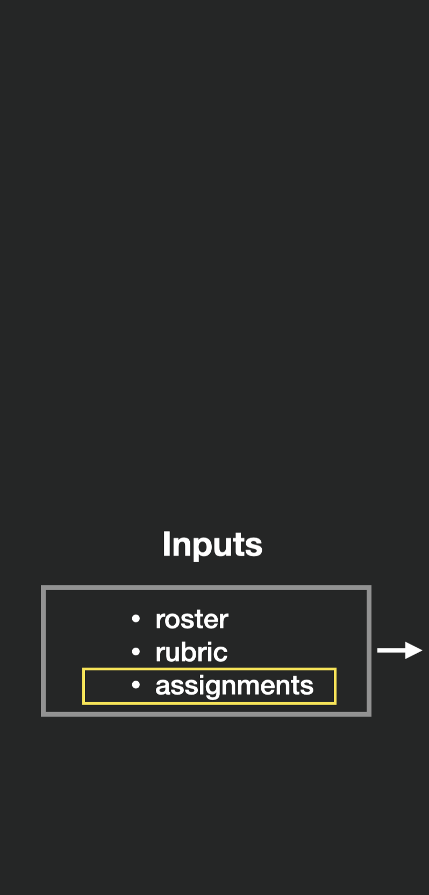
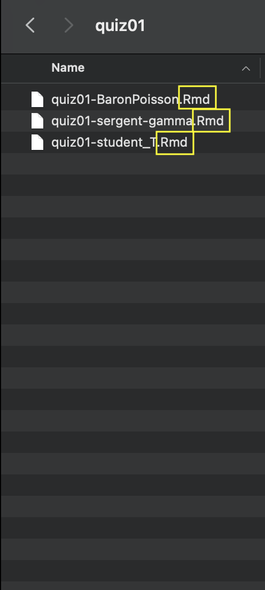
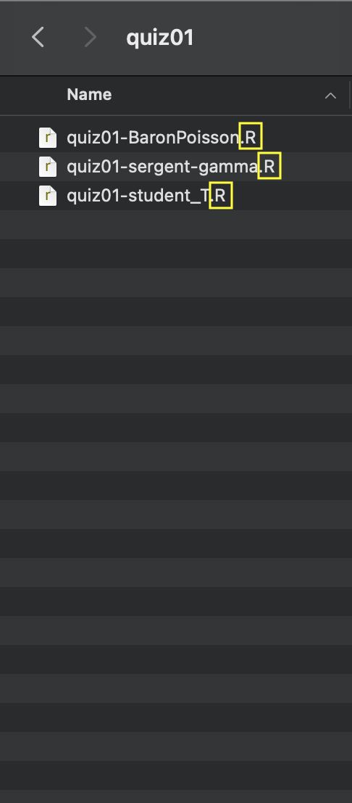
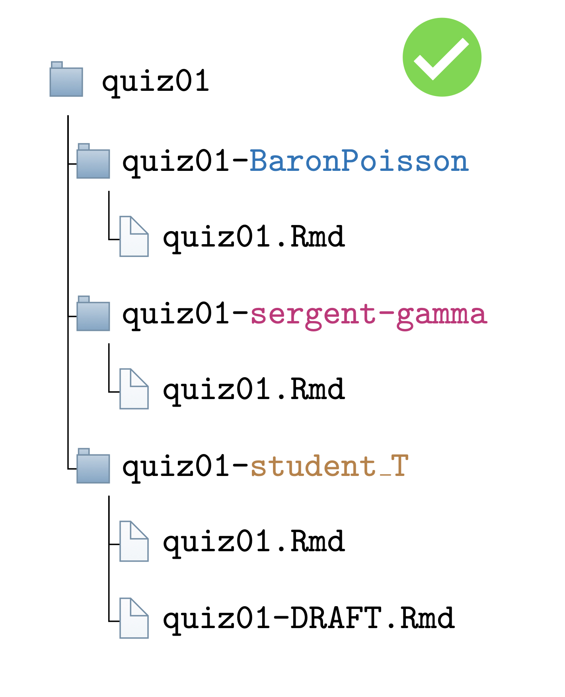
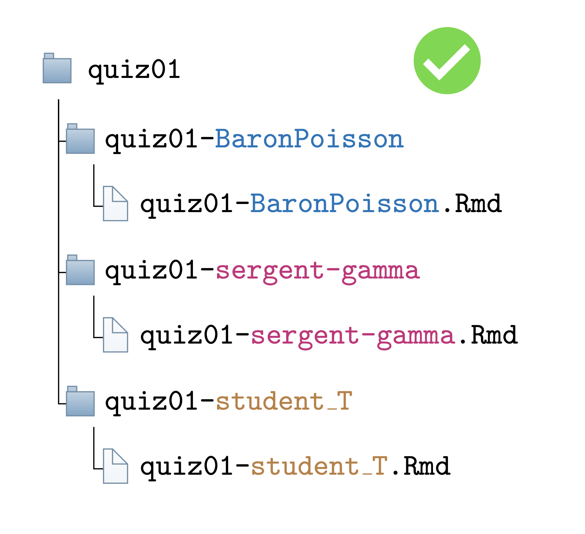
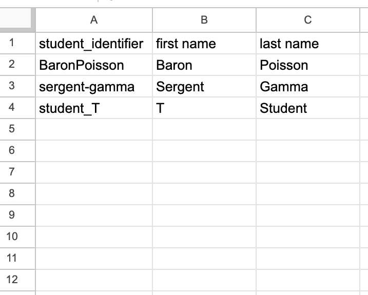
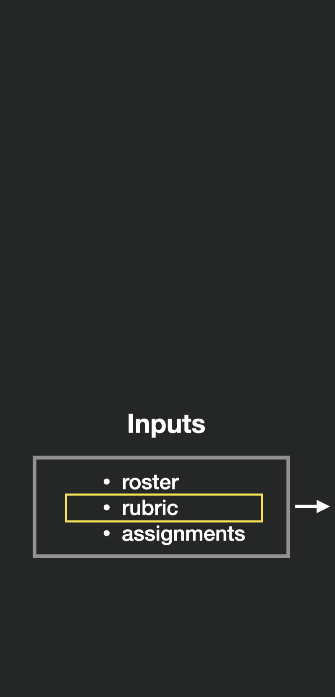

---
output:
  xaringan::moon_reader:
    css: ["utils/style.css","https://cdnjs.cloudflare.com/ajax/libs/font-awesome/6.1.1/css/all.min.css", "xaringan-themer.css"]
    lib_dir: libs
    nature:
      ratio: 16:9
      highlightStyle: solarized-light
      highlightLines: true
      countIncrementalSlides: true
      beforeInit: "utils/cols_macro.js"
---

class: middle, center

# Grading preparation

---

class: middle, center

<div class="row">
  <div class="column_left">
    
  </div>
  <div class="column_center">
    
  </div>
  <div class="column_right">
    
  </div>
</div>


---

class: middle, center

<div class="row">
  <div class="column_left">
    
  </div>
  <div class="column_center">
    
  </div>
  <div class="column_right">
    
  </div>
</div>


---

class: middle, center

<div class="row">
  <div class="column_left">
    
  </div>
  <div class="column_center">
    
  </div>
  <div class="column_right">
    
  </div>
</div>

---

class: middle, center

<div class="row">
  <div class="column_left">
      </div>
  <div class="column_center">
    
  </div>
  <div class="column_right">
    
  </div>
</div>

---

class: middle, center

<div class="row">
  <div class="column_left">
      </div>
  <div class="column_center">
    
  </div>
  <div class="column_right">
    
  </div>
</div>

---

.pull-left2[

## Assignment directories

- How submissions are stored


]

.pull-right2[

```{r echo=FALSE, out.width="100%", fig.align='right', fig.alt="A folder structure titled quiz-01. There are three files, one for each student."}
knitr::include_graphics("figures/demo-assignments-long-rmd.png")
```

]

---

.pull-left2[

## Assignment directories

- How submissions are stored
- Each student has a unique identifier:
  `BaronPoisson`

]

.pull-right2[

```{r echo=FALSE, out.width="100%", fig.align='right', fig.alt="A folder structure titled quiz-01. There are three files, one for each student."}
knitr::include_graphics("figures/demo-assignments-long-rmd-unique-part.png")
```

]

---

.pull-left2[

## Assignment directories

- How submissions are stored
- Each student has a unique identifier:
  `BaronPoisson`
- The rest of the path is common to all students:
  `quiz01/quiz01-XXXXXX`
]

.pull-right2[

```{r echo=FALSE, out.width="100%", fig.align='right', fig.alt="A folder structure titled quiz-01. There are three files, one for each student."}
knitr::include_graphics("figures/demo-assignments-long-rmd-common-part.png")
```

]

---

.pull-left2[

## Assignment directories

- How submissions are stored
- Each student has a unique identifier:
  `BaronPoisson`
- The rest of the path is common to all students:
  `quiz01/quiz01-XXXXXX`
- All submission files have the same extension:
  `quiz\quiz01-XXXXXX.Rmd`


]

.pull-right2[

```{r echo=FALSE, out.width="100%", fig.align='right', fig.alt="A folder structure titled quiz-01. There are three files, one for each student."}

```

]

---

.pull-left2[

## Assignment directories

- How submissions are stored
- Each student has a unique identifier:
  `BaronPoisson`
- The rest of the path is common to all students:
  `quiz01/quiz01-XXXXXX`
- All submission files have the same extension:
  `quiz\quiz01-XXXXXX.Rmd`
- All extensions that can be opened with `navigateToFile()` are supported

]

.pull-right2[

```{r echo=FALSE, out.width="100%", fig.align='right', fig.alt="A folder structure titled quiz-01. There are three files, one for each student."}

```

]

---

## Assignment directories: subfolders


<div class="container">
  <div class="row">
    <div class="col-sm">
    
    </div>
    <div class="col-sm">
    </div>
    <div class="col-sm">
    </div>
  </div>
</div>


---


## Assignment directories: subfolders


<div class="container">
  <div class="row">
    <div class="col-sm">
    
    </div>
    <div class="col-sm">
    
    </div>
    <div class="col-sm">
    </div>
  </div>
</div>


---


## Assignment directories: subfolders


<div class="container">
  <div class="row">
    <div class="col-sm">
    
    </div>
    <div class="col-sm">
    
    </div>
    <div class="col-sm">
        
    </div>
  </div>
</div>


---


## Assignment directories: subfolders


<div class="container">
  <div class="row">
    <div class="col-sm">
    
    </div>
    <div class="col-sm">
    </div>
    <div class="col-sm">
    </div>
  </div>
</div>


---

## Assignment directories: subfolders

<div class="container">
  <div class="row">
    <div class="col-sm">
    
    </div>
    <div class="col-sm">
    
    </div>
    <div class="col-sm">
    </div>
  </div>
</div>

---

## Assignment directories: subfolders

<div class="container">
  <div class="row">
    <div class="col-sm">
    
    </div>
    <div class="col-sm">
    
    </div>
    <div class="col-sm">
        
    </div>
  </div>
</div>

---

class: middle, center

<div class="row">
  <div class="column_left">
      </div>
  <div class="column_center">
    
  </div>
  <div class="column_right">
    
  </div>
</div>

---

class: middle

## Roster

- .csv file
- only one required column: `student_identifier` 
  - this is the identifier that is unique in the file path!

---

class: center

## Roster

```{r echo=FALSE, out.width="60%", fig.align='center', fig.alt="A spreadsheet with a single column. The first row reads student_identifier. The other three rows read BaronPoisson, sergent-gamma and student_T"}
knitr::include_graphics("figures/roster-minimal.png")
```

---

class: middle

## Roster

- .csv file
- only one required column: `student_identifier` 
  - this is the identifier that is unique in the file path!
- other columns can be present

---

class: center

## Roster
  
```{r echo=FALSE, out.width="60%", fig.align='center', fig.alt="A spreadsheet with four columns. The first row reads student_identifier, first name, last name, student ID. The other rows contain the corresponding information for three fictitious students."}

```

---

class: center, middle

## Roster <i class="fa-solid fa-arrow-right"></i> Gradebook
  
```{r echo=FALSE, out.width="100%", fig.align='center', fig.alt="On the left, a screenshot of a spreadsheet with four columns. The first row reads student_identifier, first name, last name, student ID. The other rows contain the corresponding information for three fictitious students. In the middle, a yellow arrow pointing from the figure on the left to the figure on the right. On the right, a screenshot of the same spreadsheet as the one shown on the left, but with an extra column indicating a numeric grade for each student."}
knitr::include_graphics("figures/roster_to_gradebook.png")
```

---

class: middle, center

<div class="row">
  <div class="column_left">
      </div>
  <div class="column_center">
    
  </div>
  <div class="column_right">
    
  </div>
</div>

---

## Rubric

Create template:

```{r eval = FALSE, echo = TRUE}
create_rubric_template(
  rubric_path = "your-chosen-rubric-path.csv"
)
```

--

Open file stored:

```{r, echo=FALSE}
rubric <- data.frame(
   "name" = NA,
   "total_points" = NA,
   "prompt_code" = NA,
   "prompt_message" = NA,
   "feedback" = NA,        
   "points_to_remove" = NA
)

DT::datatable(
  rubric, 
  extensions = 'FixedColumns',
  options = list(
    dom = 't',
    scrollX = TRUE,
    fixedColumns = TRUE
  )
)
```


---

## Rubric

Add at least one row for each part of the assignment:

--

```{r, echo=FALSE}

rubric[1, ]  <- c("Question 1", 10, "1a", "Wrong formula", "The correct formula is ...", 3)

DT::datatable(
  rubric, 
  options = list(
    scrollX = TRUE,
    autoWidth = TRUE,
    columnDefs = list(list(width = '100%', targets = '_all')),
    pageLength = 15, 
    lengthChange = FALSE
  ),
  callback = htmlwidgets::JS('table.page(3).draw(false);'),
  rownames= FALSE,
  autoHideNavigation = TRUE
)

```

---

## Rubric


```{r, echo=FALSE}

rubric[2, ]  <- c("Question 1", NA, "1b", "Missing intercept", "Your model should include...", 2)

DT::datatable(
  rubric, 
  options = list(
    scrollX = TRUE,
    autoWidth = TRUE,
    columnDefs = list(list(width = '100%', targets = '_all')),
    pageLength = 15, 
    lengthChange = FALSE
  ),
  callback = htmlwidgets::JS('table.page(3).draw(false);'),
  rownames= FALSE,
  autoHideNavigation = TRUE
)

```

---

## Rubric

```{r, echo=FALSE}

rubric[3, ]  <- c("Question 2", 5, "1", "...", "...", 2)

DT::datatable(
  rubric, 
  options = list(
    scrollX = TRUE,
    autoWidth = TRUE,
    columnDefs = list(list(width = '100%', targets = '_all')),
    pageLength = 15, 
    lengthChange = FALSE
  ),
  callback = htmlwidgets::JS('table.page(3).draw(false);'),
  rownames= FALSE,
  autoHideNavigation = TRUE
)

```

---

## Rubric


```{r, echo=FALSE}

rubric[4, ]  <- c("all_questions", NA, "0", "Correct", "Your answer is correct!", 0)

DT::datatable(
  rubric, 
  options = list(
    scrollX = TRUE,
    autoWidth = TRUE,
    columnDefs = list(list(width = '100%', targets = '_all')),
    pageLength = 15, 
    lengthChange = FALSE
  ),
  callback = htmlwidgets::JS('table.page(3).draw(false);'),
  rownames= FALSE,
  autoHideNavigation = TRUE
)

```

---

## Rubric

```{r, echo=FALSE}

rubric[5, ]  <- c("all_questions", NA, "99", "Missing", "Your answer is missing", 100)

DT::datatable(
  rubric, 
  options = list(
    scrollX = TRUE,
    autoWidth = TRUE,
    columnDefs = list(list(width = '100%', targets = '_all')),
    pageLength = 15, 
    lengthChange = FALSE
  ),
  callback = htmlwidgets::JS('table.page(3).draw(false);'),
  rownames= FALSE,
  autoHideNavigation = TRUE
)

```

---

## Rubric


```{r, echo=FALSE}

rubric[6, ]  <- c("general_feedback", NA, "0", "Great job", "Great job on this quiz!", NA)

DT::datatable(
  rubric, 
  options = list(
    scrollX = TRUE,
    autoWidth = TRUE,
    columnDefs = list(list(width = '100%', targets = '_all')),
    pageLength = 15, 
    lengthChange = FALSE
  ),
  callback = htmlwidgets::JS('table.page(3).draw(false);'),
  rownames= FALSE,
  autoHideNavigation = TRUE
)

```

---

## Rubric


```{r, echo=FALSE}

rubric[7, ]  <- c("general_feedback", NA, "99", "Office hours", "Please come to my next office hours and we will go through this quiz together.", NA)

DT::datatable(
  rubric, 
  options = list(
    scrollX = TRUE,
    autoWidth = TRUE,
    columnDefs = list(list(width = '100%', targets = '_all')),
    pageLength = 15, 
    lengthChange = FALSE
  ),
  callback = htmlwidgets::JS('table.page(3).draw(false);'),
  rownames= FALSE,
  autoHideNavigation = TRUE
)

```


---

## Rubric - prompts

.pull-left[
```{r echo=FALSE, out.width="100%", fig.align='right', fig.alt="A grading prompt in the RStudio console for question 1 that reads 'Enter one or more of the following options, use -- to separate multiple items.' and shows as options '1a: Wrong formula [-3]', '1b: Missing intercept [-2]', '0: Correct [-0%]', '99: Missing [-100%]'"}
knitr::include_graphics("figures/rubric-prompt-question1.png")
```
]

--

.pull-right[
```{r echo=FALSE, out.width="100%", fig.align='right', fig.alt="A grading prompt in the RStudio console  for General Feedback that reads 'Enter one or more of the following options, use -- to separate multiple items.' and shows as options '0: Great job', '99: Office hours'"}

```
]

---

## Rubric - positive grading

gradetools defaults to **negative grading** for the rubric 

```{r eval = FALSE, echo = TRUE}
create_rubric_template(
  rubric_path = "your-chosen-rubric-path.csv"
)
```


This is why the last column name is `points_to_remove`

```{r, echo=FALSE}
rubric_remove <- data.frame(
   "name" = NA,
   "total_points" = NA,
   "prompt_code" = NA,
   "prompt_message" = NA,
   "feedback" = NA,        
   "points_to_remove" = NA
)

DT::datatable(
  rubric_remove, 
  extensions = 'FixedColumns',
  options = list(
    dom = 't',
    scrollX = TRUE,
    fixedColumns = TRUE
  )
)
```

---

## Rubric - positive grading

But you can switch to **positive grading**

```{r, eval = FALSE, echo = TRUE}
create_rubric_template(
  rubric_path = "your-chosen-rubric-path.csv",
  {{negative_grading = FALSE}}
)
```


Last column will be named `points_to_add`

```{r, echo=FALSE}

rubric_add <- data.frame(
   "name" = NA,
   "total_points" = NA,
   "prompt_code" = NA,
   "prompt_message" = NA,
   "feedback" = NA,        
   "points_to_add" = NA
)

DT::datatable(
  rubric_add, 
  extensions = 'FixedColumns',
  options = list(
    dom = 't',
    scrollX = TRUE,
    fixedColumns = TRUE
  )
)

```


---

## Hands-on: prepare materials for grading

.column_left_third[

  **Submissions**
  <br>

  student identifier is the only difference between submission file paths
  <br>
  
```{r echo=FALSE, out.width="70%", fig.align='left', fig.alt="A folder structure titled quiz. There are three files, one for each student."}
knitr::include_graphics("figures/submission_small.png")
```

]

.column_center_third[
  
  **Roster**
  <br>

  student_identifier column is present in the roster
  <br>
  
```{r echo=FALSE, out.width="70%", fig.align='left', fig.alt="A spreadsheet column named student_identifier with three rows, reading Xue, Juan and Ann"}

```
]

.column_right_third[
  
  **Rubric**
  <br>

  create_rubric_template()
  <br>
  
```{r, echo=FALSE}
DT::datatable(
  rubric[c(1,3,4,6),], 
  options = list(
    scrollX = TRUE,
    autoWidth = TRUE,
    columnDefs = list(list(width = '100%', targets = '_all')),
    pageLength = 15, 
    lengthChange = FALSE
  ),
  callback = htmlwidgets::JS('table.page(3).draw(false);'),
  rownames= FALSE,
  autoHideNavigation = TRUE
)
```


]
