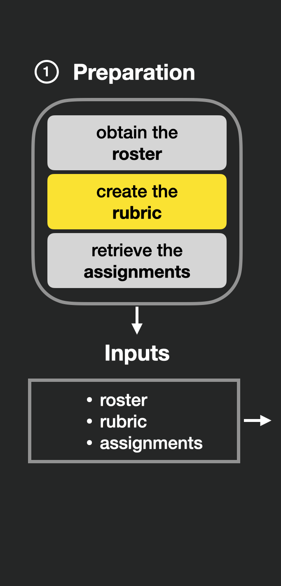
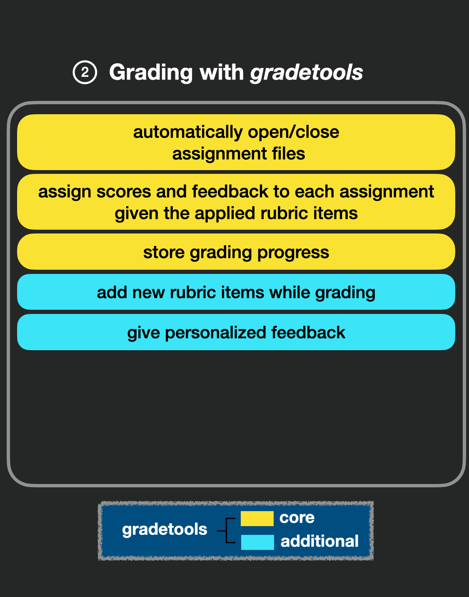
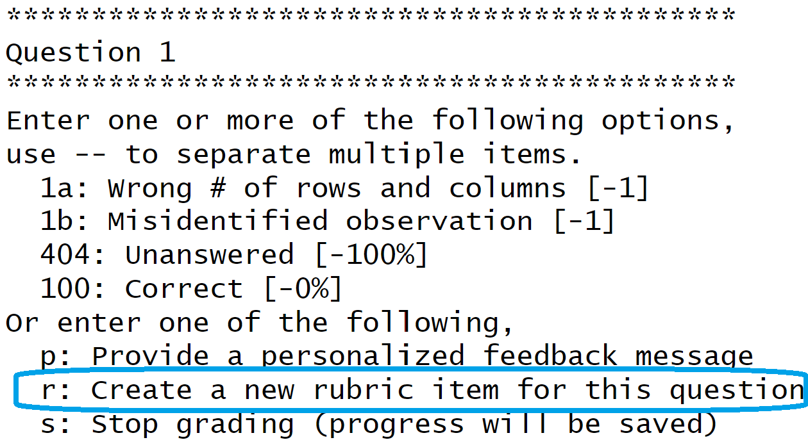
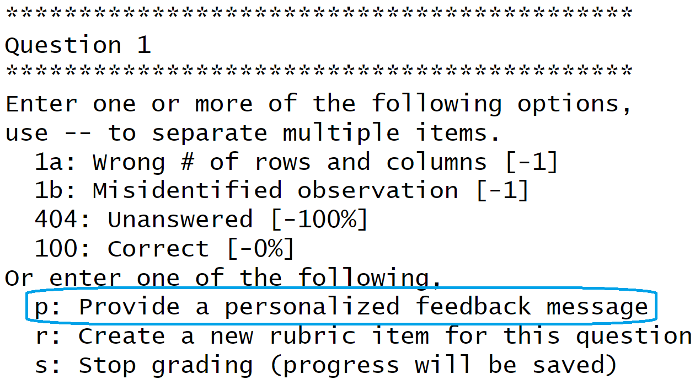
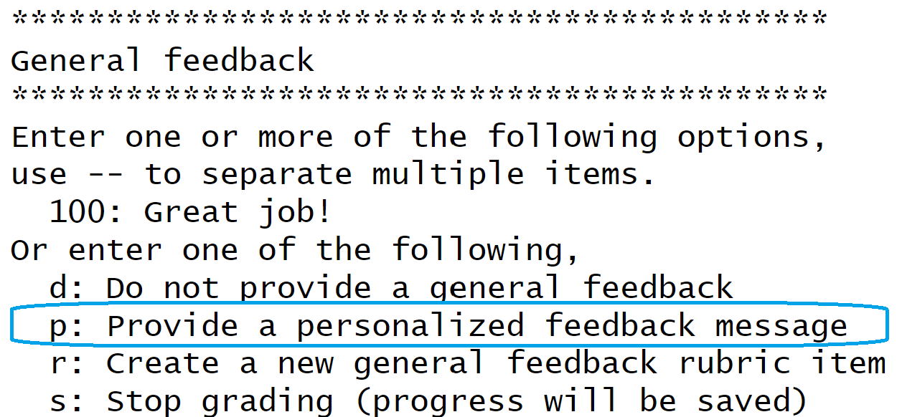
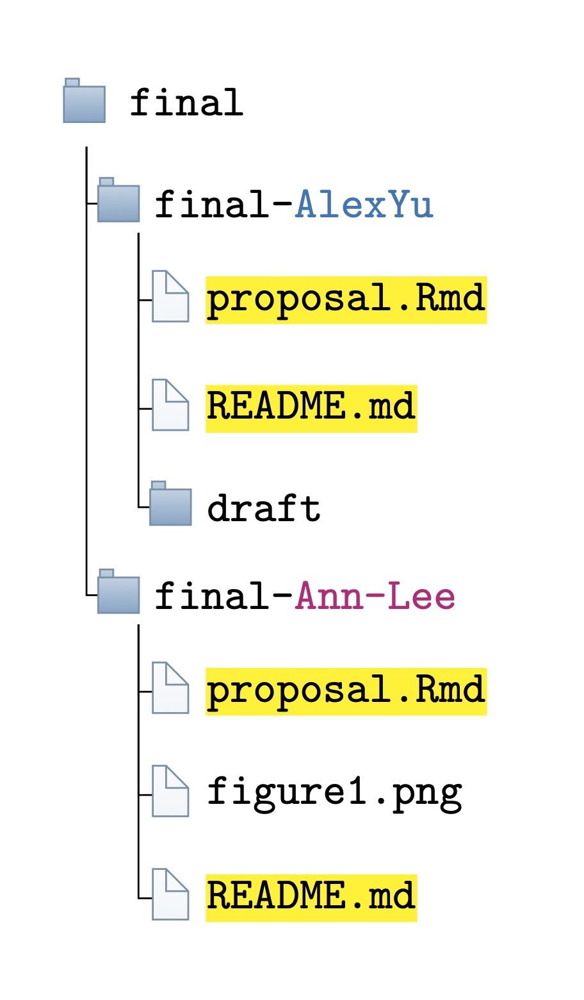
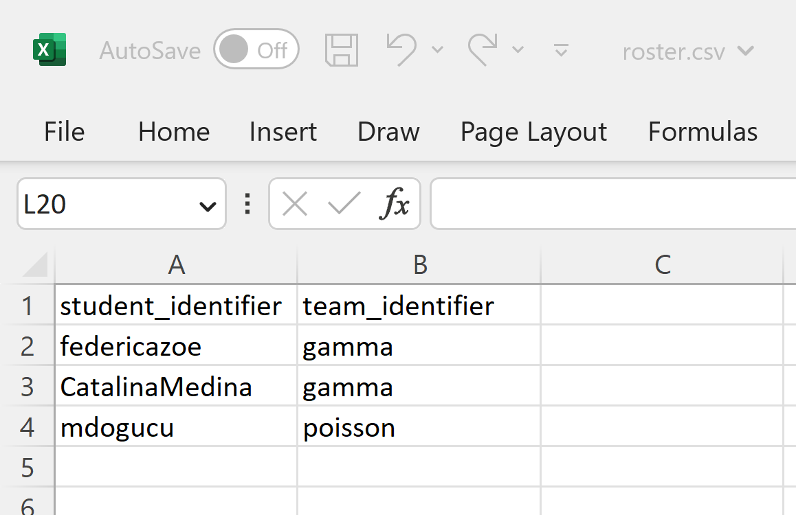

---
output:
  xaringan::moon_reader:
    css: ["utils/style.css","https://cdnjs.cloudflare.com/ajax/libs/font-awesome/6.1.1/css/all.min.css", "xaringan-themer.css"]
    lib_dir: libs
    nature:
      ratio: 16:9
      highlightStyle: solarized-light
      highlightLines: true
      countIncrementalSlides: true
      beforeInit: "utils/cols_macro.js"
---

class: middle, center

# Additional functionalities

---

class: middle, center

<div class="row">
  <div class="column_left">
    
  </div>
  <div class="column_center">
    
  </div>
  <div class="column_right">
    
  </div>
</div>

---

class: middle

## Adding a rubric item 

.pull-left[

- A rubric item can be added while grading
- The user would be prompted to supply all relevant rubric components

]

.pull-right[



]


---

class: middle

## Editing the rubric 

- Prompt messages, feedback messages, and points to remove/add call all be edited directly in the rubric
- Changes would be reflected once the grading function is rerun

--

<span style="color: orange;">
  Prompt codes cannot ever be changed because they are used to store grading progress
</span>

---

class: middle

## Providing personalized feedback

A grader can write a message to a student's feedback file without having points associated

.pull-left[
It can pertain to a certain question



]

.pull-right[
Or to the assignment overall



]

---

class: middle

## Hands-on session: using extra prompt options

- Grade another submission to practice adding rubric items and writing personalized feedback where appropriate
- Note: Running the same `assist_grading()` call will resume grading progress

---

## Selective grading 

- `assist_advanced_grading()` operates identically to `assist_grading()`, with a few extra options

--

- One extra is the ability to specify which students and which questions to grade
  - E.g. grade question 1 for all students
  
--

- These arguments are specified as character vectors
  - `questions_to_grade` must be question names present in rubric
  - `students_to_grade` must be student identifiers present in roster

---

class: middle

## Selective grading example

```{r, eval = FALSE}
assist_advanced_grading(
  rubric_path = "rubric-full.csv", 
  roster_path = "roster-minimal.csv", 
  grading_progress_log_path = "quiz01-grading-progress-log.csv", 
  final_grade_sheet_path = "quiz01-final-grade-sheet.csv", 
  example_student_identifier = "BaronPoisson",
  example_assignment_path = "quiz01/quiz01-BaronPoisson.Rmd", 
  example_feedback_path = "quiz01/quiz01-BaronPoisson-feedback.Rmd",
  {{questions_to_grade = "Question 1", }}
  {{students_to_grade = c("BaronPoisson", "sergent-gamma")}}
)
```

---

## Regrading

- `assist_regrading()` allows graders to specify which students and questions to regrade

--

- Grading process is identical to an `assist_advanced_grading()` call

--

- If this process is interrupted, only the questions for the students the grader did regrade will have changed

---

class: middle

## Hands-on session: using regrading function

Regrading example

```{r, eval = FALSE}
assist_regrading(
  rubric_path = "rubric-full.csv", 
  grading_progress_log_path = "quiz01-grading-progress-log.csv", 
  final_grade_sheet_path = "quiz01-final-grade-sheet.csv",
  {{questions_to_regrade = c("Question 1", "Question 2"), }}
  {{students_to_regrade = "BaronPoisson"}}
)
```

Regrade either 2 questions for one student or 1 question for two students.

---

## Multiple submissions per student

The grading functions allow the provided assignment path to be a vector

--

.pull-left-small[

]
--
.pull-right-large[
```{r, eval = FALSE}
example_student_identifier = "AlexYu"
example_assignment_path = c(
  "final/final-AlexYu/README.md",
  "final/final-AlexYu/proposal.Rmd"
)
```
]

---

## Team grading with `assist_team_grading()`

.pull-left[
- For the case of multiple students per submission (e.g. group project)
- Students on a team share a feedback file and score

]

.pull-right[

]


---

## Team grading with `assist_team_grading()`

.pull-left[
- For the case of multiple students per submission (e.g. group project)
- Students on a team share a feedback file and score

]

.pull-right[
- Roster must have both student and team identifiers  

]



---

## Team grading with `assist_team_grading()`

.pull-left[
- For the case of multiple students per submission (e.g. group project)
- Students on a team share a feedback file and score

]

.pull-right[
- Roster must have both student and team identifiers
- Team identifier must be present and only unique part of assignment and feedback paths
]

```{r, eval = FALSE}
example_team_identifier = "gamma"
example_assignment_path = "final-projects/team-gamma/presentation.Rmd"
example_feedback_path = "final-projects/team-gamma/feedback.Rmd"
```
