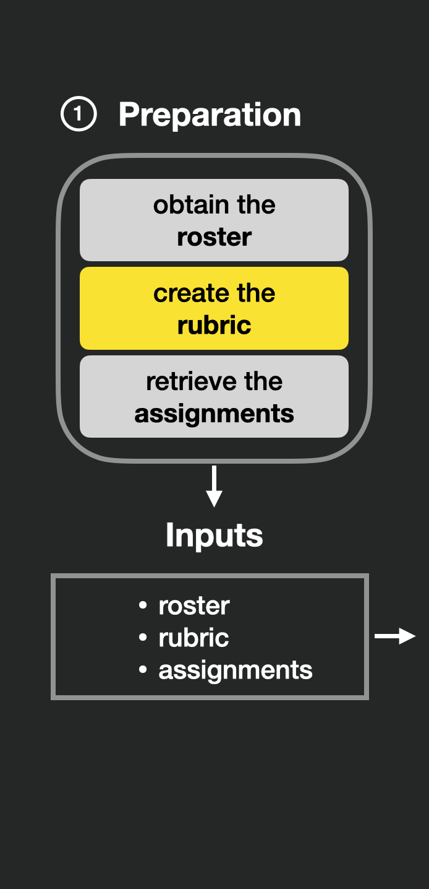

---
output:
  xaringan::moon_reader:
    css: ["utils/style.css","https://cdnjs.cloudflare.com/ajax/libs/font-awesome/6.1.1/css/all.min.css", "xaringan-themer.css"]
    lib_dir: libs
    nature:
      ratio: 16:9
      highlightStyle: solarized-light
      highlightLines: true
      countIncrementalSlides: true
      beforeInit: "utils/cols_macro.js"
---

class: middle, center

# gradetools **+** GitHub

---

## Outline for this part

- Why use GitHub for a course

--

- End-to-end GitHub course + gradetools:

--

  - Setting up a class on GitHub

--

  - Distributing work to students

--
  
  - Collecting students' work
  
--

  - Grading
  
--

  - Distributing feedback to students

---

## Outline for this part

.pull-left2[

- Why use GitHub for a course

- End-to-end GitHub course + gradetools:

  - Setting up a class on GitHub

  - Distributing work to students

  - Collecting students' work
  
  - **Grading**
  
  - **Distributing feedback to students**
]

.pull-right2[

```{r echo=FALSE, fig.align='center', out.width = "100%", fig.alt = "Hex logo of gradetools: a cat typing on a laptop that a gradebook and differently colored paper planes"}
knitr::include_graphics("figures/gradetools-logo.png")
```

]


  
---
class:  middle

## Terminology <sup>1</sup>
.footnote[[1] based on GitHub Docs]

**GitHub repository (repo)** - A folder/space on GitHub that contains all of a project's files and each file's revision history. 

--

**GitHub issue** - ways to plan work, track issues, and discuss projects goals.

--

**GitHub push** - action that results in changes made to repo on your laptop to be reflected online on GitHub (i.e. repo --> GitHub)

--

**GitHub pull** - action that results in changes made to repo online on GitHub to be reflected on your laptop (i.e. GitHub --> repo)

---

class: middle


## Why use GitHub for a course?

- reproducibility, version control, collaboration

--

- students can learn GitHub _by using it_

--

- we can easily share individualized feedback with students

--

- package [ghclass](https://rundel.github.io/ghclass/)<sup>1</sup> makes it easy to manage courses on GitHub using R
.footnote[[1] by Colin Rundel and Mine Cetinkaya-Rundel]


---

## GitHub for a course?

.pull-left-small[

Our favorite way:

- One **GitHub _organization_** per course

  (NOT GitHub _classroom_)


]

.pull-right-large[

```{r echo=FALSE, fig.align='center', out.width = "100%", fig.alt = "Screenshot of GitHub webpage showing an organization with 'stats295r-fa20'. There are 14 repositories and 34 people in the organization."}
knitr::include_graphics("figures/github-org.png")
```

]


---

## GitHub for a course?

.pull-left-small[

Our favorite way:

- One repo per student, per week or assignment

]

.pull-right-large[

```{r echo=FALSE, fig.align='center', out.width = "100%", fig.alt = "Screenshot of repos in the organization 'stats295r-fa20' named 'week1-federicazoe', 'week2-federicazoe', 'week3-fedeericazoe' and so on."}

```

]

---

## GitHub for a course?

.pull-left-small[

Our favorite way:

- Quizzes and homework distributed and submitted in the repo

]

.pull-right-large[

```{r echo=FALSE, fig.align='center', out.width = "100%", fig.alt = "screenshot of files included in the repo 'week1-federicazoe'. The list includes a mix of .R, .Rmd and .md files and a filed named '01f-homework.Rmd'."}

```

]

---

## Github for class + gradetools for grades

```{r xaringan-panelset, echo=FALSE}
xaringanExtra::use_panelset()
```

.panelset[
.panel[.panel-name[1 Class setup]
On **GitHub**:

- 1.1 Create a new GitHub organization
- 1.2 Create one repo for your week 1 assignments

With **ghclass**:

- 1.3 Invite students to your organization

]

.panel[.panel-name[2 Assigning work]
With **ghclass**:

- 2.1 Add an assignment to the week 1 repo 
- 2.2 Automatically create a week 1 repo for each student
]

.panel[.panel-name[3 Grading]
With **ghclass**

- 3.1 Collect students' work

With **gradetools**:

- 3.2 Take notes of issues while grading

- 3.3 Create issues in students (or team) repos

- 3.4 Push feedback files

]
]

---


## 1. Class setup: GitHub

.pull-left2[
1.1 Create a new [GitHub organization](https://docs.github.com/en/organizations/collaborating-with-groups-in-organizations/creating-a-new-organization-from-scratch).

]

.pull-right2[

```{r echo=FALSE, fig.align='center', out.width = "80%", fig.alt = "screenshot of the portion of github website where it lists the options available for someone who has signed up, and the option 'Your organizations' is highlighted."}
knitr::include_graphics("figures/github-org-your-org.png")
```

]


---

## 1. Class setup: GitHub


1.1 Create a new [GitHub organization](https://docs.github.com/en/organizations/collaborating-with-groups-in-organizations/creating-a-new-organization-from-scratch)

```{r echo=FALSE, fig.align='center', out.width = "100%", fig.alt = "screenshot of a portion of github website where we see Organizations and a button to crate a new organization, which is highlighted."}
knitr::include_graphics("figures/github-org-new.png")
```

---

## 1. Class setup: GitHub

1.1 Create a new [GitHub organization](https://docs.github.com/en/organizations/collaborating-with-groups-in-organizations/creating-a-new-organization-from-scratch)

```{r echo=FALSE, fig.align='center', out.width = "40%", fig.alt = "screenshot of a portion of github website where we see the button to create a free organization."}

```

---

## 1. Class setup: GitHub

1.1 Create a new [GitHub organization](https://docs.github.com/en/organizations/collaborating-with-groups-in-organizations/creating-a-new-organization-from-scratch)

```{r echo=FALSE, fig.align='center', out.width = "50%", fig.alt = "screenshot of github website where we see how a organization is set up by specifying the organization account name, the contact email of the organization and whether the organization belongs to a personal account or to a business. These fields are filled-in for a organization named example-course-federicazoe, the email associated with it is fzricci@uci.edu and the option chosen is that the org belongs to a personal account."}

```

---

## 1. Class setup: GitHub

1.1 Create a new [GitHub organization](https://docs.github.com/en/organizations/collaborating-with-groups-in-organizations/creating-a-new-organization-from-scratch)

```{r echo=FALSE, fig.align='center', out.width = "60%", fig.alt = "screenshot of github website where after the organization is created we could add members to it. The button Skip this step is highlighted."}

```


---

## 1. Class setup: GitHub 

1.1 Create a new [GitHub organization](https://docs.github.com/en/organizations/collaborating-with-groups-in-organizations/creating-a-new-organization-from-scratch)

```{r echo=FALSE, fig.align='center', out.width = "70%", fig.alt = "screenshot of newly created github organization 'example-course-federicazoe'. There are no repositories and the count of the number of people is 1."}
knitr::include_graphics("figures/github-org-created.png")
```

---

## 1. Class setup: GitHub 

1.2 Create a repo for week 1 assignments in your organization   
(e.g. week01-data-viz)

```{r echo=FALSE, fig.align='center', out.width = "100%", fig.alt = "Screenshot of GitHub webpage showing the option to create a new repository in our new organization example-course-federicazoe."}

```

---

## 1. Class setup: ghclass <sup>1</sup>
.footnote[[1] Much more info on [ghclass website](https://rundel.github.io/ghclass/articles/ghclass.html#structuring-your-class-on-github)]

Install and load <a href="https://rundel.github.io/ghclass/">ghclass</a>.

```{r, eval=FALSE}
install.packages("ghclass")
library(ghclass)
```

---

## 1. Class setup: ghclass <sup>1</sup><sup>,2</sup>
.footnote[[1] Much more info on [ghclass website](https://rundel.github.io/ghclass/articles/ghclass.html#structuring-your-class-on-github); [2] Prerequisites: GitHub token setup]

1.3 Invite students to the organization

```{r, eval=FALSE}
# Invite students to the organization using ghclass
org_invite(org = "example-course-federicazoe", 
           user = c("CatalinaMedina", "felipe-jones"))
```

```{r, eval = FALSE}
#> ✓ Invited user "CatalinaMedina" to org "example-course-federicazoe".
#> ✓ Invited user "felipe-jones" to org "example-course-federicazoe".
```

---

## 2. Assign work: ghclass 

2.1 Prepare template repo for one assignment: 
  - Add assignment to this repo

```{r, eval=FALSE}
repo_add_file(
  org_repos("example-course-federicazoe","week01-data-viz"),
  message = "Add quiz on data visualization",
  file = here::here("demonstration-materials/github-demo/quiz01-data-viz.Rmd")
)
```
```{r, eval = FALSE}
#> ✓ Added file "quiz01-data-viz.Rmd" to repo "example-course-federicazoe/week01-data-viz".
```
---

## 2. Assign work: ghclass 

2.1 Prepare template repo for one assignment: 
  - Set this repo as a template:
  
```{r, eval=FALSE}
repo_set_template("example-course-federicazoe/week01-data-viz")
```

```{r, eval = FALSE}
#> ✓ Changed the template status of repo "example-course-federicazoe/week01-data-viz" to TRUE.
```

---

## 2. Assign work: ghclass 

2.2 Distribute assignment to students:

```{r, eval=FALSE}
org_create_assignment(
  org = "example-course-federicazoe",
  user = c("CatalinaMedina", "felipe-jones"),
  repo = paste0("week01-data-viz-", c("CatalinaMedina", "felipe-jones")),
  source_repo = "example-course-federicazoe/week01-data-viz",
  private = TRUE
)
```

```{r, eval = FALSE}
#> ✔ Mirrored repo "example-course-federicazoe/week01-data-viz" to repo "example-course-federicazoe/week01-data-viz-CatalinaMedina".
#> ✔ Mirrored repo "example-course-federicazoe/week01-data-viz" to repo "example-course-federicazoe/week01-data-viz-felipe-jones".
#> ✔ User "CatalinaMedina" given "push" access to repo "example-course-federicazoe/week01-data-viz-CatalinaMedina"
#> ✔ User "felipe-jones" given "push" access to repo "example-course-federicazoe/week01-data-viz-felipe-jones"
```

---

## 3. Grading: ghclass 

3.1 Collect students' work

```{r, eval=FALSE}
local_repo_clone(
  repo = org_repos("example-course-federicazoe", "week01-data-viz"),
  local_path = "demonstration-materials/github-demo/week01-data-viz"
)
```  
  
```{r, eval = FALSE}
#> ✓ Cloned "example-course-federicazoe/week01-data-viz".
#> ✔ Cloned "example-course-federicazoe/week01-data-viz-CatalinaMedina".
#> ✔ Cloned "example-course-federicazoe/week01-data-viz-felipe-jones".
```

---

## 3. Grading: gradetools 

3.2 Take notes of issues while grading

```{r, eval=FALSE}

{{assist_advanced_grading(}}
  rubric_path,
  roster_path,
  grading_progress_log_path,
  final_grade_sheet_path,
  example_assignment_path,
  example_feedback_path,
  example_student_identifier,
  {{github_issues = TRUE}}
)

```

---

## 3. Grading: gradetools 

3.2 Take notes of issues while grading

```{r, eval=FALSE}

assist_advanced_grading(
  {{rubric_path,}}
  {{roster_path,}}
  {{grading_progress_log_path,}}
  {{final_grade_sheet_path,}}
  {{example_assignment_path,}}
  {{example_feedback_path,}}
  {{example_student_identifier,}}
  github_issues = TRUE
)

```

Note: the other arguments are the same as before.


---

## 3. Grading: gradetools 

.pull-left-small[

3.2 Take notes of issues while grading

]

.pull-right-large[

```{r echo=FALSE, fig.align='center', out.width = "100%", fig.alt = "screenshot of RStudio console with a grading prompt with an highlighted portion that says the prompt code 'i' corresponds to 'Take note of a GitHub issue (not push)'."}

```

]

---

## 3. Grading: gradetools 

.pull-left-small[

3.2 Take notes of issues while grading

]

.pull-right-large[

```{r echo=FALSE, fig.align='center', out.width = "100%", fig.alt = "Screenshot of a R prompt to provide title of issue. Title provided is 'answer question for partial credit'."}
knitr::include_graphics("figures/github-issue-title.png")
```

]

---

## 3. Grading: gradetools 

.pull-left-small[

3.2 Take notes of issues while grading

3.3 Create issues in students (or team) repos

]

.pull-right-large[

```{r echo=FALSE, fig.align='center', out.width = "100%", fig.alt = "screenshot of GitHub showing an issue titled 'Answer question for partial credit' and whose body says 'Push an updated submission by Monday June 5'."}

```

]

---

## 3. Grading: gradetools 

.pull-left-small[

3.2 Take notes of issues while grading

3.3 Create issues in students (or team) repos

3.4 Push feedback files

]

.pull-right-large[

```{r echo=FALSE, fig.align='center', out.width = "100%", fig.alt = "screenshot of RStudio console showing confirmation that three feedback files have been pushed to GitHub after running the function push_to_github()'."}
knitr::include_graphics("figures/github-pushed-feedback.png")
```

]

---

## 3. Grading: gradetools 

Create issues and push feedback files to GitHub

```{r, eval=FALSE}

{{push_to_github(}}
  grading_progress_log_path,
  class_github_name,
  example_identifier,
  example_github_repo,
  {{push_feedback = TRUE,}}
  {{create_issues = TRUE}}
)

```

---

## 3. Grading: gradetools 

Create issues and push feedback files to GitHub

```{r, eval=FALSE}

push_to_github(
  {{grading_progress_log_path,}}
  class_github_name,
  example_identifier,
  example_github_repo,
  push_feedback = TRUE,
  create_issues = TRUE
)

```

Where grading log was stored while grading.

---

## 3. Grading: gradetools 

Create issues and push feedback files to GitHub

```{r, eval=FALSE}

push_to_github(
  grading_progress_log_path,
  {{class_github_name,}}
  example_identifier,
  example_github_repo,
  push_feedback = TRUE,
  create_issues = TRUE
)

```

The name of the GitHub organization (e.g. `example-course-federicazoe`).

---

## 3. Grading: gradetools 

Create issues and push feedback files to GitHub

```{r, eval=FALSE}

push_to_github(
  grading_progress_log_path,
  class_github_name,
  {{example_identifier,}}
  example_github_repo,
  push_feedback = TRUE,
  create_issues = TRUE
)

```

An example GitHub identifier (e.g. `CatalinaMedina`).

---
## 3. Grading: gradetools 

Create issues and push feedback files to GitHub

```{r, eval=FALSE}

push_to_github(
  grading_progress_log_path,
  class_github_name,
  example_identifier,
  {{example_github_repo,}}
  push_feedback = TRUE,
  create_issues = TRUE
)

```

An example GitHub repo for the assignment (e.g. `week01-data-viz-CatalinaMedina`).

---
## 3. Grading: gradetools 

Create issues and push feedback files to GitHub

```{r, eval=FALSE}
push_to_github(
  grading_progress_log_path = "grade-log.csv",
  class_github_name = "example-course-federicazoe",
  example_identifier = "CatalinaMedina",
  example_github_repo = "week01-data-viz-CatalinaMedina",
  push_feedback = TRUE,
  create_issues = TRUE
)
```

```{r, eval=FALSE}
#> ✔ Added file "quiz01-feedback.Rmd" to repo "example-course-federicazoe/week01-data-viz-CatalinaMedina".
#> ✔ Created issue "Submit for partial credit" for repo "example-course-federicazoe/week01-data-viz-CatalinaMedina".
```

---

class: middle, center

<div class="row">
  <div class="column_left">
    
  </div>
  <div class="column_center">
    
  </div>
  <div class="column_right">
    
  </div>
</div>

---
class: middle center

## Acknowledgements


```{r echo=FALSE, fig.alt="NSF logo", out.width = "10%", fig.align="center"}
knitr::include_graphics("figures/nsf-logo.png")
```

NSF HDR DSC award \#2123366 

```{r echo=FALSE, fig.alt="Hasso Plattner Institute in Machine Learning and Data Science logo", out.width = "20%", fig.align="center"}
knitr::include_graphics("figures/hpi-logo.jpeg")
```

HPI


---

class: middle

## Thank you for your time!

- Please let us know any suggestions for gradetools: [feedback form](https://forms.gle/MwyxmT6zEf9tokCM9) 

```{r echo=FALSE, out.width="10%", fig.align='center', fig.alt="QR code linking to feedback form above"}

```

- Keep an eye out for the gradetools manuscript (in progress), which describes our package from a development viewpoint
- For more information and practice visit the gradetools website (https://federicazoe.github.io/gradetools/)
